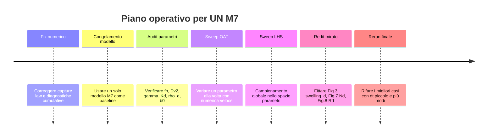
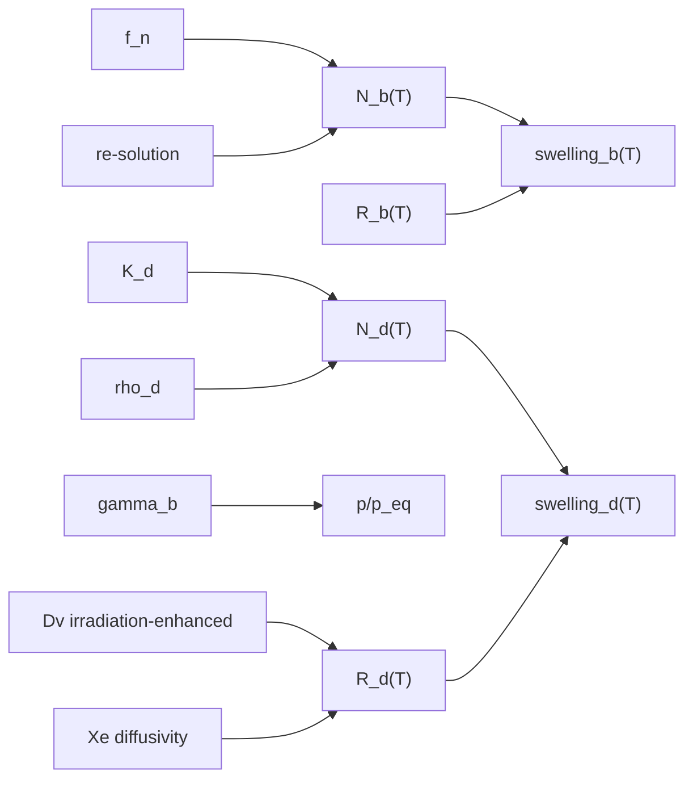

# Audit analitico dei parametri del modello UN M7

## Executive summary

L’audit del modello **UN M7** porta a cinque conclusioni forti.

La prima è che il modello che stai facendo girare è già, strutturalmente, un modello “fisico” ragionevole per la swelling intragranulare in UN: ha due popolazioni di bolle, crescita controllata da diffusione di Xe e vacanze, re-solution, coalescenza lungo dislocazioni e trasferimento bulk→dislocation. Questo è coerente con l’impostazione generale del lavoro di **Rizk 2025**, che identifica proprio le bolle su dislocazione come la popolazione cruciale per la swelling di breakaway, e con la base sperimentale di **Ronchi et al. 1978**, che misura **microscopic swelling** mediante microscopia elettronica, non semplice variazione volumetrica macroscopica del pellet. citeturn25search6turn51search0

La seconda è che i **parametri più critici e meno robusti** non sono quelli “ovvi” come \(k_B\), \(a\) o \(r_d\), ma quelli **ibridi o ereditati**: in particolare **\(f_n\)**, i coefficienti della **vacancy diffusivity irradiation-enhanced** \((A_{20}, B_{21}, B_{22})\), la coppia **\(K_d,\rho_d\)**, e la **legge di capture** bulk→dislocation. Di questi, il caso più sospetto è proprio la **vacancy diffusivity**: la letteratura accessibile conferma il quadro multiscala usato da Rizk/Cooper, ma non consente di ricostruire in modo univoco i coefficienti numerici usati in Rizk dalla preview disponibile; questo è coerente con la tua osservazione precedente che la curva pubblicata e i numeri tabulati non si sovrappongono. Perciò questo parametro va trattato come **altissima priorità di re-fit**. citeturn38search0turn51search1turn25search6

La terza è che **\(f_n=10^{-6}\)** appare come un valore **ereditato**, non come una costante verificata per UN. In UO\(_2\) la nucleazione classica di Turnbull è **eterogenea** lungo le tracce dei frammenti di fissione, con stime tipiche dell’ordine di **5–25 bolle per frammento di fissione**, cioè una parametrizzazione concettualmente diversa da un fattore omogeneo \(f_n\) moltiplicativo del termine \(8\pi D_g \Omega_{fg}^{1/3} c^2\). Il valore \(10^{-6}\) compare chiaramente nei modelli U\(_3\)Si\(_2\)/BISON come valore adottato, ma non emerge come “misura primaria UN”. Quindi in UN va considerato **un parametro di chiusura modellistica**, non una proprietà misurata. citeturn47search1turn35search48turn29search0

La quarta è che, sul piano dimensionale, le equazioni chiave sono **essenzialmente consistenti**, inclusa la correzione **\(-3/5\)** nel sink dislocazionale, che è effettivamente coerente con la formulazione Barani per il trapping vicino al core. Le unità “strane” sono invece quelle dei coefficienti dei termini irradiation-induced nelle diffusività: per esempio, in \(D_3=A_{30}\dot F\), \(A_{30}\) non è un puro numero ma deve avere unità tali da restituire m\(^2\)/s; analogamente per \(A_{20}\sqrt{\dot F}\). Nel codice questo è implicitamente corretto, ma **non documentato**, e questa mancanza favorisce errori di trascrizione. citeturn45search5turn28search1turn38search0

La quinta è che la **capture law attuale** è la criticità numerico-fisica più immediata da correggere. Il termine
\[
f_{\mathrm{cap,raw}} = N_d\,\Delta V_{\mathrm{cap}}
\]
è una buona approssimazione **solo nel limite rare-event** \(\mu=N_d\Delta V_{\mathrm{cap}}\ll 1\). La somma cumulativa `capture_fraction_cumulative += f_cap` non rappresenta una vera frazione fisica e infatti può superare 1. La forma robusta è
\[
f_{\mathrm{cap}} = 1-\exp(-s_{\mathrm{cap}}N_d\Delta V_{\mathrm{cap}})
\]
e la cumulata fisica va ricostruita da \(N_b\), non dalla somma delle frazioni di passo. Questo è il primo fix che farei prima di ogni sweep serio. 

## Base dell’audit e limiti

In questa sessione **non ho potuto aprire direttamente i file `.md` locali** del progetto che menzioni (`UNmodel.md`, `UNcode.md`, `b_g_nu_comparison.md`, ecc.). Perciò l’audit interno è stato fatto su:

- il **codice M7** che hai incollato nella conversazione;
- le fonti web accessibili relative a **Rizk 2025**, **Ronchi 1978**, **Cooper 2023**, **Schneider 2024**, **Matthews 2015**, **Barani/Pizzocri/SCIANTIX** e riferimenti originari collegati. citeturn25search6turn51search0turn38search0turn51search1turn40search0turn36search0turn49search1

Quindi: la parte “code audit” è ad **alta confidenza**, la parte “Rizk exact table/page/eq number” è a **confidenza media** quando la preview Elsevier non mostra direttamente la tabella, e i casi non verificabili li segnalo esplicitamente come tali.

## Inventario dei parametri nel codice M7

Di seguito censisco i **parametri fisici e numerici che entrano nella soluzione**. Escludo solo gli array dei dati sperimentali e le opzioni di I/O puro.

### Parametri fisici principali

| Parametro | Valore nel codice | Unità | Posizione nel codice | Ruolo nelle equazioni |
|---|---:|---|---|---|
| `temperature` | 1600 | K | `UNParameters.temperature` | Temperatura locale |
| `fission_rate` | \(5.0\times10^{19}\) | fiss m\(^{-3}\) s\(^{-1}\) | `UNParameters.fission_rate` | Produzione gas, diffusività irradiation-driven, re-solution |
| `grain_radius` | \(6.0\times10^{-6}\) | m | `UNParameters.grain_radius` | Lunghezza caratteristica PolyPole / rilascio al bordo di grano |
| `xe_yield` | 0.24 | at fiss\(^{-1}\) | `UNParameters.xe_yield` | Termine sorgente \(\beta = y \dot F\) |
| `D10` | \(1.56\times10^{-3}\) | m\(^2\) s\(^{-1}\) | `UNParameters.D10` | Prefattore \(D_{g,1}\) Xe termico |
| `Q1` | 4.94 | eV | `UNParameters.Q1` | Energia attivazione \(D_{g,1}\) |
| `A30` | \(1.85\times10^{-39}\) | m\(^5\) fiss\(^{-1}\) | `UNParameters.A30` | Termine atermico Xe: \(D_{g,3}=A_{30}\dot F\) |
| `D10_vU` | \(1.35\times10^{-2}\) | m\(^2\) s\(^{-1}\) | `UNParameters.D10_vU` | Prefattore \(D_{v,1}\) termico |
| `Q1_vU` | 5.66 | eV | `UNParameters.Q1_vU` | Energia attivazione \(D_{v,1}\) |
| `A20_vU_fig4_refit` | \(4.63045\times10^{-29}\) | coeff. del termine \(\sqrt{\dot F}\) | `UNParameters.A20_vU_fig4_refit` | Termine irradiation-enhanced delle vacanze |
| `B21_vU_refit` | -0.62 | eV | `UNParameters.B21_vU_refit` | Esponente nel termine \(D_{v,2}\) |
| `B22_vU_refit` | -0.04 | eV\(^2\) | `UNParameters.B22_vU_refit` | Esponente quadratico nel termine \(D_{v,2}\) |
| `radius_in_lattice` | \(0.21\times10^{-9}\) | m | `UNParameters.radius_in_lattice` | Raggio del gas atomico in trappola / capture radius |
| `omega_fg` | \(8.5\times10^{-29}\) | m\(^3\) at\(^{-1}\) | `UNParameters.omega_fg` | Volume specifico Xe per costruire volume bolla |
| `lattice_parameter` | \(4.889\times10^{-10}\) | m | `UNParameters.lattice_parameter` | \(\Omega_\mathrm{matrix}=a^3/4\), conversione burnup↔tempo |
| `gamma_b` | 1.11 | J m\(^{-2}\) | `UNParameters.gamma_b` | Equilibrio di Laplace \(p_{eq}=2\gamma/R-\sigma_h\) |
| `hydrostatic_stress` | 0 | Pa | `UNParameters.hydrostatic_stress` | Termine meccanico in \(p_{eq}\) |
| `f_n` | \(1.0\times10^{-6}\) | – | `UNParameters.f_n` | Fattore di nucleazione bulk |
| `rho_d` | \(3.0\times10^{13}\) | m\(^{-2}\) | `UNParameters.rho_d` | Densità di dislocazioni |
| `K_d` | \(5.0\times10^{5}\) | bubble m\(^{-1}\) | `UNParameters.K_d` | Bolle nucleate per unità di linea di dislocazione |
| `r_d` | \(3.46\times10^{-10}\) | m | `UNParameters.r_d` | Raggio del core dislocazionale nel sink |
| `Z_d` | 5 | – | `UNParameters.Z_d` | Fattore geometrico nel sink dislocazionale |
| `N_d0` | \(K_d\rho_d=1.5\times10^{19}\) | bubble m\(^{-3}\) | `__post_init__` | Valore iniziale della popolazione su dislocazioni |
| `R_b, N_b, R_d, N_d` | 0,0,0,\(N_d0\) | varie | stato iniziale | Stato iniziale delle due popolazioni |
| `mb0, md0, c0` | 0 | at m\(^{-3}\) | stato iniziale | Gas in matrice / bolle bulk / bolle dislocation |
| `vacancy_absorption_only` | `True` | bool | opzione solver | Impedisce emissione di vacanze se \(p_{int}\le p_{eq}\) |

### Parametri numerici e controlli

| Parametro | Valore nel codice | Unità | Posizione | Ruolo |
|---|---:|---|---|---|
| `DT_H` | 1 | h | configurazione utente | Passo temporale |
| `N_MODES` | 40 | – | configurazione utente | Numero di modi PolyPole |
| `target_burnup_percent_fima` | variabile | %FIMA | `UNParameters` | Fissa il tempo finale |
| `TEMPS_MAIN` | 900–2000 | K | configurazione | Griglia T per confronto |
| `BURNUPS` | 1.1, 1.3, 3.2 | %FIMA | configurazione | Burnup di validazione |
| `bulk_seed_radius_nm` | 0 | nm | opzione | Seed artificiale bulk, qui spento |

### Osservazioni immediate sul set di parametri

Il set è diviso in tre classi.

La prima comprende parametri **fortemente ancorati** a fonti o definizioni fisiche: \(a\), \(r_d\), \(k_B\), \(\Omega_\text{matrix}\), e anche \(N_{d0}=K_d\rho_d\) come quantità derivata.

La seconda comprende parametri **meccanicistico-semiempirici ma difendibili**: \(D_{g,1}\), \(Q_1\), \(A_{30}\), il termine di re-solution \(b_0(R)\), e il sink dislocazionale con \(-3/5\). Questi arrivano da letteratura abbastanza chiara o da modelli consolidati. citeturn38search0turn51search1turn40search0turn45search5

La terza comprende i veri parametri da auditare/ri-fittare: **\(f_n\)**, **\((A_{20},B_{21},B_{22})\)** delle vacanze, **\(\gamma_b\)**, **\(K_d\)**, **\(\rho_d\)** e la **capture law**. Sono i parametri che controllano quasi tutta la forma della curva \(swelling_d(T)\).

## Confronto con Rizk e con le fonti originarie

### Cosa si riesce a verificare con buona confidenza

Il lavoro di **Rizk 2025** dichiara che il modello è costruito in modo multiscala e che le bolle su dislocazione sono **cruciali** per la swelling complessiva; inoltre collega la breakaway swelling alla transizione del meccanismo di diffusione dello Xe da regime atermico/irradiation-driven a regime termico alle alte temperature. Questo è pienamente coerente con il comportamento che stai osservando in M7, dove \(swelling_d\) domina ad alta \(T\). citeturn25search6

Le basi atomistiche di questa parte sono oggi chiaramente ricondotte a due famiglie di lavori:

- **Cooper et al. 2023** per la diffusività di self-defects e Xe in UN, con distinzione tra regimi \(D_1\), \(D_2\), \(D_3\) e con ancoraggio a dati di U e N self-diffusion e Xe diffusivity. citeturn38search0turn38search1
- **Schneider et al. 2024** per la parte atermica da mixing balistico in UN. citeturn28search1turn51search1

La base sperimentale per il confronto swelling–\(T\) resta **Ronchi, Ray, Thiele 1978**, che parla esplicitamente di **microscopic swelling investigated by electron microscopy**. Questo punto è importante: i dati di Ronchi non sono, in origine, una pura misura di volume macroscopico del pellet, ma una ricostruzione microstrutturale della swelling da osservazioni TEM/EM. Quindi il fatto che tu voglia fittare soprattutto la **dislocation swelling** e non la total swelling è metodologicamente sensato e allineato allo spirito con cui Rizk ha usato quel database. citeturn51search0turn25search6

### Tabella di confronto dei parametri chiave

| Parametro | Valore nel codice M7 | Valore attribuibile a Rizk / famiglia Rizk | Fonte primaria / originaria | Giudizio |
|---|---:|---:|---|---|
| \(a\) | 4.889 Å | coerente con UN a bassa T | Hayes et al. 1990, correlazione \(a(T)\) per UN | **coerente** citeturn19search0turn19search2 |
| \(r_d\) | 3.46 Å | coerente se \(b=a/\sqrt2\) per struttura NaCl/fcc | derivabile da \(a=4.889\) Å | **coerente** |
| \(D_{g,1}\): \(D_{10},Q_1\) | \(1.56\times10^{-3}\), 4.94 eV | in linea con framework Cooper/Rizk | Cooper et al. 2023, Rizk 2025 | **coerente** ma da verificare contro PDF finale citeturn38search0turn25search6 |
| \(D_{g,3}\): \(A_{30}\) | \(1.85\times10^{-39}\) | in linea con diffusività atermica UN | Schneider et al. 2024 / Rizk 2025 | **coerente** citeturn51search1turn25search6 |
| \(D_{v,1}\): \(D_{10,vU},Q_{1,vU}\) | \(1.35\times10^{-2}\), 5.66 eV | verosimilmente da Cooper/Rizk | Cooper et al. 2023 | **probabilmente coerente** citeturn38search0 |
| \(D_{v,2}\): \(A_{20},B_{21},B_{22}\) | **refit utente** | i numeri pubblicati da Rizk non tornano con la curva secondo il tuo controllo | Cooper et al. 2023 / Rizk 2025 | **altissima priorità di audit** |
| \(b_0(R)\) re-solution | formula radiale implementata | coerente con approccio non-ossido | Matthews, Schwen, Klein 2015; retroterra Ronchi/Elton 1986 | **coerente come forma**, ma trasferimento UC→UN da validare citeturn40search0turn44search0 |
| \(f_n\) | \(10^{-6}\) | appare ereditato dal workflow U\(_3\)Si\(_2\)/BISON, non misurato in UN | report INL/BISON U\(_3\)Si\(_2\) e Barani 2019 | **ingiustificato per UN come valore “fisico”** citeturn35search48turn29search0 |
| \(K_d\) | \(5\times10^5\) bubble/m | compatibile con formalismo Barani \(N_{d0}=K\rho_d\) | Barani et al. 2020 | **parametro di chiusura**, non primaria UN citeturn25search2 |
| \(\rho_d\) | \(3\times10^{13}\) m\(^{-2}\) | ordine di grandezza compatibile con modelli UO\(_2\)/SCIANTIX | SCIANTIX / Barani | **ragionevole ma non provato per UN-P2** citeturn49search32turn25search2 |
| \(\omega_{fg}\) | \(8.5\times10^{-29}\) m\(^3\)/at | classico volume di van der Waals dello Xe | letteratura FGR/SCIANTIX/UO\(_2\) | **standard ma non UN-specifico** citeturn20search0turn20search15 |
| \(\gamma_b\) | 1.11 J/m\(^2\) | non verificata direttamente da preview Rizk | secondarie accessibili indicano 1.44 J/m\(^2\) per UN(001), area-weighted non ricostruita | **sospetta / da verificare** citeturn21search5 |
| base sperimentale swelling | confronto a `swelling_d` | Rizk usa Ronchi 1978 | Ronchi 1978 TEM microscopic swelling | **confronto a swelling_d giustificato** come prima approssimazione citeturn51search0turn25search6 |

### Il punto cruciale su \(f_n\)

Qui la situazione è abbastanza netta.

Il codice usa
\[
\nu_b = 8\pi f_n D_g \Omega_{fg}^{1/3} c^2,
\]
quindi una **nucleazione bulk omogenea diffusion-assisted**.

La letteratura classica di Turnbull in UO\(_2\) invece descrive bolle intragranulari **eterogeneamente nucleate** nel wake dei frammenti di fissione; le review successive riportano valori tipici dell’ordine di **5–25 bolle per fission fragment** per questo quadro eterogeneo. Il valore \(f_n=10^{-6}\) non è quindi la controparte “naturale” del mondo Turnbull/Ronchi, ma una **costante fenomenologica di un’altra closure law**. Nei report INL/BISON su U\(_3\)Si\(_2\) il valore \(10^{-6}\) appare chiaramente come scelta standard adottata nel modello ingegneristico, non come costante UN validata sperimentalmente. Quindi abbassarlo o alzarlo non significa “correggere una proprietà del materiale”, ma cambiare l’intensità di una chiusura modellistica. citeturn47search1turn35search48turn29search0

Questa è una delle ragioni per cui le tue curve possono non assomigliare a quelle di Rizk anche se “i numeri sembrano giusti”: potresti avere **la forma giusta del modello ma la closure sbagliata per la nucleazione**.

### Il punto cruciale sulla vacancy diffusivity

Il framework fisico è chiaro: Cooper 2023 distingue regime termico, irradiation-enhanced e atermico; Rizk 2025 costruisce la swelling UN proprio sull’interazione tra queste diffusività e la crescita delle bolle, in particolare su dislocazioni. Però i numeri dei coefficienti della parte vacancy irradiation-enhanced **non sono ricostruibili in modo affidabile** dalla preview accessibile, mentre tu hai già evidenza pratica che i coefficienti numerici “pubblicati/usati prima” non riproducevano la curva di Fig. 4. Questo è il profilo tipico di un **errore di trascrizione tabella↔figura**, o di unità non documentate in modo chiaro. Va trattato come il candidato n.1 a un errore nel paper o nella sua trasposizione a codice. citeturn38search0turn51search1turn25search6

## Verifica dimensionale, parametri sospetti e capture law

### Verifica di consistenza dimensionale delle equazioni chiave

#### Trapping su dislocazioni

Nel codice:
\[
g_d = 4\pi D_g(R_d+r_g)N_d + \frac{2\pi D_g}{\ln\!\left(\Gamma_d/(Z_dr_d)\right)-3/5}\,\left(\rho_d-2R_dN_d\right),
\qquad
\Gamma_d=\frac1{\sqrt{\pi \rho_d}}.
\]

Controllo unità:

- \(D_g\): m\(^2\)/s
- \(R_d\): m
- \(N_d\): m\(^{-3}\)

Il primo termine dà s\(^{-1}\).  
Nel secondo termine, \(\rho_d-2R_dN_d\) ha unità m\(^{-2}\), il logaritmo è adimensionale, dunque tutto il termine dà ancora s\(^{-1}\). La correzione \(-3/5\) è compatibile con la formulazione riportata da Barani per il trapping dislocazionale. Quindi **nessuna incoerenza dimensionale** qui. citeturn45search5

#### Nucleazione bulk

Nel codice:
\[
\nu_b = 8\pi f_n D_g\Omega_{fg}^{1/3}c^2.
\]

Se il numero di atomi è trattato come “conteggio” e non come dimensione separata, allora \(c\) ha unità m\(^{-3}\) e \(\nu_b\) ha unità m\(^{-3}\)s\(^{-1}\), coerente con \(\mathrm dN_b/\mathrm dt\). Quindi **dimensionalmente il codice è coerente** nel formalismo rate-theory usuale. Il problema qui non è l’unità, ma la **fisica della closure** \(f_n\).

#### Re-solution

Nel codice:
\[
b_b = \dot F\, b_0(R_b),\qquad b_d=\dot F\,b_0(R_d).
\]

Se \(b_0\) è il parameter di re-solution in m\(^3\)/fissione-atomo, il risultato è s\(^{-1}\), coerente con l’uso in \(\phi b\). Matthews 2015 conferma il quadro di una **re-solution parameter radiale** per combustibili non-ossido, con forte dipendenza da \(R\) fino a circa 50 nm. citeturn40search0turn41search0

#### Vacancy diffusivity

Nel codice:
\[
D_v = D_{v,1}+D_{v,2},
\qquad
D_{v,1}=D_{10,vU}\exp(-Q_{1,vU}/k_BT),
\]
\[
D_{v,2}= \sqrt{\dot F}\,A_{20}\exp\!\left(\frac{B_{21}}{k_BT} + \frac{B_{22}}{(k_BT)^2}\right).
\]

Il termine è coerente se \(A_{20}\) porta le unità necessarie a trasformare \(\sqrt{\dot F}\) in m\(^2\)/s. Qui non c’è errore dimensionale, ma c’è **un forte rischio documentale**: se non si esplicitano le unità di \(A_{20}\), gli errori di trascrizione diventano facilissimi.

### Parametri da flaggare

#### \(f_n = 10^{-6}\)

**Motivo del flag.** Non emerge come costante primaria UN; appare ereditato da U\(_3\)Si\(_2\)/BISON. Inoltre mescola una closure di nucleazione omogenea con un database sperimentale che nasce in un contesto di nucleazione/organizzazione largamente eterogenea. citeturn35search48turn47search1

**Impatto atteso.** Molto alto su \(N_b\), gas in bulk, competizione bulk↔dislocation, onset della swelling.

**Raccomandazione.** Trattarlo come parametro libero di primo livello. Range iniziale consigliato: \(10^{-7}\)–\(10^{-5}\) in OAT; range esteso \(10^{-8}\)–\(10^{-4}\) solo se necessario.

**Priorità.** **Alta**.

#### Coefficienti \(A_{20}, B_{21}, B_{22}\) della vacancy diffusivity irradiation-enhanced

**Motivo del flag.** È il punto dove hai già un’indicazione empirica di inconsistenza tra coefficienti e curva; la preview accessibile non consente verifica conclusiva dei numeri tabulati nel paper. citeturn38search0turn51search1

**Impatto atteso.** **Massimo** su \(R_d(T)\), \(N_d(T)\), \(swelling_d(T)\), specialmente vicino alla transizione 1500–1800 K.

**Raccomandazione.** Tenere **fisso** il termine termico \(D_{v,1}\) e usare il tuo **refit della Fig. 4** come baseline; introdurre poi uno scaling sul solo \(D_{v,2}\).

**Priorità.** **Molto alta / prima assoluta**.

#### \(\gamma_b = 1.11\) J/m\(^2\)

**Motivo del flag.** Non l’ho potuta ricondurre con alta confidenza a una fonte primaria UN accessibile in questa sessione. Una fonte secondaria accessibile riporta 1.44 J/m\(^2\) per il piano (001) di UN citando Bocharov et al.; potrebbe essere che 1.11 J/m\(^2\) sia una media Wulff area-weighted o una scelta interpolata, ma senza PDF locale non posso confermarlo. citeturn21search5

**Impatto atteso.** Medio-alto su \(p/p_{eq}\), assorbimento di vacanze, dimensione bolla ad alta \(T\).

**Raccomandazione.** Sweep \(0.8\)–\(1.5\) J/m\(^2\); se possibile verificare il valore da fonte DFT originale UN.

**Priorità.** **Media-alta**.

#### \(K_d\) e \(\rho_d\)

**Motivo del flag.** Sono fisicamente sensati ma non emergono come valori sperimentali robusti specifici dei pins P2-UN. Il formalismo \(N_{d0}=K_d\rho_d\) è giusto; i numeri sono ancora parametri di struttura più che proprietà misurate una volta per tutte. citeturn25search2turn49search32

**Impatto atteso.** Fortissimo su \(N_d\), \(R_d\) e quindi \(swelling_d\).

**Raccomandazione.** Sweep congiunto, non separato in fase finale, perché sono correlati nella sola quantità \(N_{d0}\) ma si separano anche nel sink.

**Priorità.** **Alta**.

#### Re-solution \(b_0(R)\)

**Motivo del flag.** La forma è coerente con la fisica non-ossido; però la validazione sperimentale diretta è fatta soprattutto su UC/non-oxide generico, non su UN. Matthews 2015 stesso sottolinea la scarsità di esperimenti diretti per UC e l’uso di rate-equation models per riprodurre bubble populations ad alta T. citeturn40search0turn51search0

**Impatto atteso.** Medio-alto, soprattutto nelle popolazioni piccole e nella redistribuzione gas matrice↔bolle.

**Raccomandazione.** Introdurre uno scaling \(s_b\) tra 0.3 e 3.

**Priorità.** **Media-alta**.

### La capture law attuale e la forma robusta consigliata

Nel codice corrente:

```python
Vcap_new = sphere_volume(R_b + R_d)
delta_Vcap = max(Vcap_new - Vcap_old, 0.0)
f_cap = max(0.0, min(N_d * delta_Vcap, 1.0))
...
captured_bubbles = f_cap * N_b
...
capture_fraction_cumulative += f_cap
```

Il problema è duplice.

Primo: \(N_d\Delta V_{cap}\) è solo un’approssimazione lineare della probabilità di intercettazione, valida per eventi rari.

Secondo: `capture_fraction_cumulative += f_cap` **non è una frazione fisica cumulata** ma una somma di frazioni di passo; per questo può superare 1. Non è un bug matematico della somma, è un bug semantico del nome e dell’interpretazione.

La forma fisicamente robusta è quella di un processo di Poisson:

\[
\mu_{cap} = s_{cap} N_d \Delta V_{cap},
\qquad
f_{cap} = 1-e^{-\mu_{cap}}.
\]

e la popolazione bulk sopravvissuta va aggiornata come

\[
N_b^{new}=N_b^{old}e^{-\mu_{cap}}.
\]

### Sostituzione di codice consigliata

```python
# --- add once near user/config parameters ---
CAPTURE_SCALE = 1.0

# --- at solver init, store a reference for a physical cumulative capture metric ---
N_b_ref = max(p.N_b, 1.0e-300)
capture_mu_cumulative = 0.0
capture_fraction_cumulative = 0.0   # redefine this as a physical cumulative fraction
capture_bubbles_cumulative = 0.0

# --- replace the current capture block with this ---
Vcap_new = sphere_volume(R_b + R_d)
delta_Vcap = max(Vcap_new - Vcap_old, 0.0)

mu_cap = CAPTURE_SCALE * max(N_d, 0.0) * delta_Vcap
f_cap = 1.0 - math.exp(-mu_cap) if mu_cap > 0.0 else 0.0

if f_cap > 0.0 and N_b > 0.0:
    mb_before = max(mb_new, 0.0)
    md_before = max(md_new, 0.0)
    nvb_before = max(nvb, 0.0)
    nvd_before = max(nvd, 0.0)
    N_b_before = N_b

    # Poisson survival of bulk bubbles
    N_b = N_b_before * math.exp(-mu_cap)
    captured_frac = 1.0 - (N_b / N_b_before if N_b_before > 0.0 else 0.0)
    captured_bubbles = N_b_before - N_b

    # conserve gas and vacancy content
    mb_new = (1.0 - captured_frac) * mb_before
    md_new = md_before + captured_frac * mb_before
    nvb = (1.0 - captured_frac) * nvb_before
    nvd = nvd_before + captured_frac * nvb_before

    # robust cumulative diagnostics
    capture_mu_cumulative += mu_cap
    capture_bubbles_cumulative += captured_bubbles
    capture_fraction_cumulative = 1.0 - (N_b / N_b_ref)

    modes_c, modes_mb, modes_md = reset_modes_to_averages(c_new, mb_new, md_new, p.n_modes)

    V_b = (p.omega_fg * max(mb_new, 0.0) + omega_matrix(p) * nvb) / N_b if N_b > 0.0 else 0.0
    V_d = (p.omega_fg * max(md_new, 0.0) + omega_matrix(p) * nvd) / N_d if N_d > 0.0 else 0.0
    R_b = radius_from_volume(max(V_b, 0.0))
    R_d = radius_from_volume(max(V_d, 0.0))
```

### Test minimi da fare dopo la sostituzione

```python
# 1) probabilità fisica
assert 0.0 <= f_cap <= 1.0

# 2) conservazione del gas
assert abs((mb_before + md_before) - (mb_new + md_new)) <= 1e-12 * max(1.0, mb_before + md_before)

# 3) conservazione delle vacanze associate alle bolle
assert abs((nvb_before + nvd_before) - (nvb + nvd)) <= 1e-12 * max(1.0, nvb_before + nvd_before)

# 4) monotonia
assert N_b <= N_b_before + 1e-300

# 5) limite rare-event
if mu_cap < 1e-6:
    assert abs(f_cap - mu_cap) / max(mu_cap, 1e-300) < 1e-4
```

## Piano d’azione prioritario

### Ordine corretto dei lavori



### Quali parametri sweepare per primi

La gerarchia che consiglio è questa.

#### Primo blocco

1. **scale del termine irradiation-enhanced delle vacanze** \(s_{Dv2}\)  
2. **\(K_d\)**  
3. **\(\rho_d\)**  
4. **\(f_n\)**  

Questi quattro controllano quasi tutta la forma di \(swelling_d(T)\), \(N_d(T)\), \(R_d(T)\).

#### Secondo blocco

5. **scale del re-solution** \(s_b\)  
6. **\(\gamma_b\)**  
7. **scale del sink dislocazionale/pipe diffusion** \(s_{g_d}\)  
8. **capture scale** \(s_{cap}\), ma **solo dopo** aver corretto la legge di capture

#### Terzo blocco

9. **fission rate** \(\dot F\), ma in un intorno ristretto del nominale  
10. **grain radius** \(r_g\)  
11. eventuale **stress idrostatico efficace** o scaling del termine vacanze

### Range consigliati

| Parametro | Range OAT iniziale | Range LHS consigliato | Nota |
|---|---|---|---|
| \(s_{Dv2}\) | 0.3 – 3 | 0.1 – 10 | priorità massima |
| \(K_d\) | \(1\times10^5\) – \(1\times10^6\) | \(5\times10^4\) – \(2\times10^6\) | bolle/m |
| \(\rho_d\) | \(1\times10^{13}\) – \(1\times10^{14}\) | \(5\times10^{12}\) – \(2\times10^{14}\) | m\(^{-2}\) |
| \(f_n\) | \(10^{-7}\) – \(10^{-5}\) | \(10^{-8}\) – \(10^{-4}\) | fenomenologico |
| \(s_b\) | 0.3 – 3 | 0.1 – 10 | re-solution |
| \(\gamma_b\) | 0.8 – 1.5 | 0.7 – 1.7 | J/m\(^2\) |
| \(s_{g_d}\) | 0.3 – 3 | 0.1 – 10 | pipe/dislocation sink |
| \(s_{cap}\) | 0.3 – 3 | 0.1 – 5 | solo dopo il fix |
| \(\dot F\) | \(3\times10^{19}\) – \(8\times10^{19}\) | \(2\times10^{19}\) – \(1\times10^{20}\) | non troppo largo |
| \(r_g\) | 3 – 12 µm | 2 – 20 µm | secondario su swelling_d |

### Osservabili da usare nel fit



Io userei questa sequenza di fit:

1. **Fig. 7 / \(N_d(T)\)** a 1.3% FIMA  
2. **Fig. 8 / \(R_d(T)\)** a 1.3% FIMA  
3. **Fig. 3 / \(swelling_d(T)\)** fino a circa **1700 K**  

Il motivo di limitare inizialmente il fit di swelling a circa 1700 K è pratico: sopra quella zona aumentano molto le sensibilità a capture, eventuale venting non modellato perfettamente, e concorrenza con fenomeni che il tuo M7 nominale non rappresenta ancora in modo pienamente robusto.

### Taglia degli sweep

Per non impallare il notebook e non rischiare disconnessioni WSL:

- **OAT iniziale**: 7–9 punti per parametro, numerica veloce con `dt = 12–24 h`, `n_modes = 15–20`.
- **LHS coarse**: 150–300 campioni.
- **Refine** sui migliori 10–20 set: `dt = 3–6 h`, `n_modes = 25–30`.
- **Finale**: solo 3–5 casi, `dt = 1 h`, `n_modes = 40`.

## Prompt Deep Research pronto all’uso

Di seguito un prompt più “operativo” di quello che hai scritto, strutturato per massimizzare il recupero delle fonti primarie e l’output in CSV.

```text
Esegui un audit completo dei parametri del modello UN M7 usato nel progetto “UN Thesis”.

ISTRUZIONI PRIORITARIE
1) Leggi PER PRIMA i file locali del progetto:
   - UNmodel.md
   - UNcode.md
   - b_g_nu_comparison.md
   - eventuali altri .md nella stessa cartella
2) Estrai tutti i parametri fisici e numerici usati nel modello M7 e nel codice associato.
3) Non eseguire codice. Fai solo analisi documentale e letteratura.
4) Dai priorità a fonti primarie e ufficiali:
   - paper originali citati da Rizk 2025
   - articoli J. Nucl. Mater.
   - OSTI / INL / JRC / repository istituzionali
   - documentazione ufficiale SCIANTIX / BISON se pertinente
5) Se una fonte è paywalled, usa abstract, repository istituzionali, accepted manuscript, OSTI, INL, JRC, LANL, ORNL, ANL o citazioni secondarie affidabili. Esplicita sempre quando una verifica non è completa.

TASK
A. Costruisci una tabella completa:
   parametro | valore_nel_codice | unità | file_locale / funzione / equazione | ruolo_fisico

B. Per ogni parametro fisico principale, trova:
   parametro | valore_in_Rizk | citazione esatta in Rizk (pagina, tabella, equazione) | fonte originale citata da Rizk | valore_nella_fonte_originale | unità | commento su consistenza

C. Flagga i parametri sospetti:
   - parametri ereditati senza giustificazione per UN
   - possibili errori di trascrizione
   - coefficienti con unità non dichiarate bene
   - differenze tra tabella e figura
   Per ognuno fornisci:
   motivo_del_flag | impatto atteso sul modello | valore/range raccomandato | priorità

D. Verifica dimensionalmente le equazioni chiave del modello:
   - trapping g_d
   - nucleation nu_b
   - resolution b_b / b_d
   - vacancy diffusivity Dv1, Dv2
   - capture bulk->dislocation
   Riporta eventuali incoerenze o punti ambigui.

E. Analizza la base sperimentale di Ronchi 1978:
   - chiarisci se la “swelling” usata da Rizk corrisponde a swelling microscopica da TEM o swelling totale del pellet
   - chiarisci se i dati sono riferiti soprattutto alle large bubbles/dislocation bubbles
   - cita esattamente le sezioni utili

F. Restituisci un piano di calibrazione:
   - quali parametri sweepare per primi
   - range consigliati
   - quali figure usare per il fit:
     * Fig.3 swelling_d vs T
     * Fig.7 N_d vs T
     * Fig.8 R_d vs T
   - suggerisci OAT e LHS

OUTPUT RICHIESTO
1) Report in ITALIANO con executive summary iniziale
2) Tabelle in formato leggibile
3) Blocco CSV finale con schema:
   parameter,code_value,unit,rizk_value,rizk_location,original_source,original_value,original_unit,consistency_flag,priority,notes
4) Se possibile, includi un elenco finale “open questions”

NON FARE
- non inventare table/eq numbers
- non assumere che un valore U3Si2 valga automaticamente per UN
- non trattare come “proprietà del materiale” un parametro puramente di chiusura del modello senza dirlo
```

## Open questions e limiti residui

1. **File `.md` locali non letti direttamente in questa sessione.** Questo è il limite principale dell’audit interno.
2. **Table/eq number esatti di Rizk 2025**: non tutti sono verificabili dalla preview accessibile; servirebbe il PDF completo o i file locali che già possiedi.
3. **\(\gamma_b=1.11\)**: non l’ho potuto riconciliare con una fonte primaria UN ad alta confidenza.
4. **Coefficienti numerici pubblicati da Rizk per la vacancy diffusivity irradiation-enhanced**: proprio il punto più delicato resta da verificare contro PDF completo/local files.
5. **Interpretazione esatta della swelling Ronchi usata da Rizk**: il quadro generale è chiaro — swelling microscopica da microscopia elettronica — ma il dettaglio “solo large bubbles/dislocation bubbles oppure ricostruzione totale di più popolazioni” richiede la lettura completa del paper del 1978 e, idealmente, del paper Rizk lato metodi. citeturn51search0turn25search6

Se vuoi, nel prossimo passaggio posso trasformare questo report in una **checklist operativa brevissima** per il notebook: prima fix capture, poi OAT su 4 parametri, poi LHS.