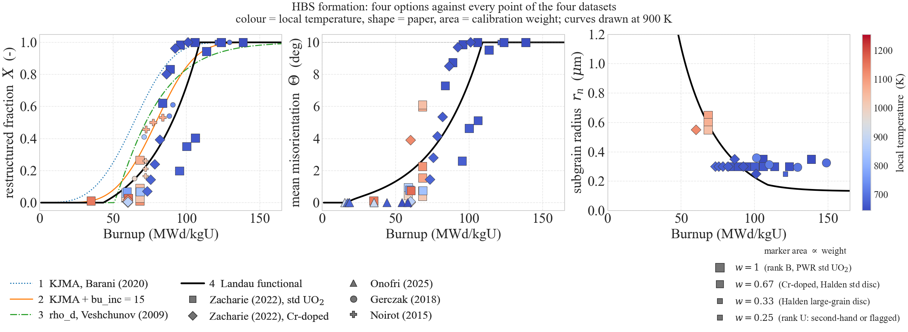

# HBS formation as a second-order phase transition (Landau functional)

Reference implementation of `iHighBurnupStructureFormation = 4`.

The High Burnup Structure is treated as a **continuous (second-order-like) transition**. 

The order
parameter is the mean misorientation of the subgrains normalized to its maximum,
`eta = theta/theta_max` with `theta_max = theta_HAGB`, so `eta` runs over the full
`[0, 1]`; the external condition is the local burnup. The energy is built by splitting the dislocations into three populations that must add
up to `rho_tot` — free, stored in low-angle walls, annihilated by the sweeping boundaries —
and giving each the line energy of the state it is in, cut off at the spacing of the
dislocations in that state (Read–Shockley in the walls). Minimizing it over the range of
`eta` for which that partition is physical gives the equilibrium misorientation; the
subgrain size follows from the same wall geometry; the restructured fraction follows from
the lever rule.

Model output:

| output | symbol | unit | equation | SCIANTIX variable |
|---|---|---|---|---|
| mean misorientation | `Theta` | deg | (8) | `Mean misorientation` |
| subgrain radius | `r_n` | m | (9) | `Subgrain radius` |
| restructured fraction | `X` | - | (10) | `Restructured volume fraction` |

The dislocation density is fixed to **Nogita & Une (1994)**, read as a pure source term; only the
part above a critical density ρ_crit is partitioned, which gives a continuous threshold.

> **Updated 2026-09-22.** The model now uses Read–Shockley cut-offs, an exponential sweep and a
> critical dislocation density ρ_crit (fitted: 6.85e14 m⁻², threshold at 47.1 GWd/tU; see the
> critical review below). `case 4` of
> `src/models/HighBurnupStructureFormation.C` has been ported to match, and
> `compare_with_sciantix.py` agrees on all 5001 steps of `test_UO2HBS_landau`, whose gold file
> has been re-blessed.

## Files

| file | what it is |
|---|---|
| `hbs_formation_landau.py` | model |
| `data/*.json` | the experimental datasets, one file per paper (copies of `HBS_2026/data/json`) |
| `calibrate.py` | calibration of the Landau model: single fit, `--front` (weights of the objective), `--study` (data sets, point influence, leave one paper out) |
| `hbs_dataset.py` | reads `data/*.json` into calibration rows and targets |
| `compare_with_sciantix.py` | checks that the C++ reproduces this script |
| `compare_formation_options.py` | runs formation options 1-4 on one irradiation and compares them |
| `comparison.py` | the four formation options against every point of the four datasets, weighted by quality rank x relevance |
| `phasefield_tandogan_1d.py` | 1-D HMP orientation phase field of Tandogan et al. (JMPS 2026, Sec. 2), driven by `rho_tot` and `G` from the Landau model, with an irradiation source in place of the plastic one; checked against the paper's Cu bicrystal; optional 1-D periodic polycrystal (ring of N grains) and an experimental lattice rotation prescribed by the Landau model (off, fails its go/no-go test). The docstring lists every assumption (paper / 1D reduction / UO2 / numerics), the unknowns and the known errors |
| `uo2_gb_energy.py` | UO2 `gamma(Delta theta)` from the 5-DOF function of Zhang et al. (JACerS 2021, `Zhang/`), reduced to one degree of freedom three ways (random axis+plane, symmetric tilt `<100>`, `<110>`); caches `data/uo2_gb_energy.csv`, the fit target of `phasefield_tandogan_1d.py` |
| `Zhang/` | Python translation of the Bulatov-Reed-Kumar GB5DOF function with the UO2 parameters, plus the supplementary MD data of Zhang et al. |
| `figures/` | figures, regenerated by the scripts above |
| `presentation/hbs_landau.tex` | Beamer deck on the model, the balance and the results (`latexmk -pdf`) |
| `../runHBS.sh` | build SCIANTIX, run the four `regression/hbs` cases, draw the comparative figures, check the C++ against this script |


---

## How to run

Everything at once, from anywhere in the repo:

```bash
./utilities/runHBS.sh              # build, run the four hbs cases, draw the figures, check the port
./utilities/runHBS.sh --no-build   # reuse the existing build/sciantix.x
./utilities/runHBS.sh --gold       # re-bless the gold files as well
```

Or one piece at a time:

```bash
python3 hbs_formation_landau.py --selftest        # the model against itself
python3 hbs_formation_landau.py --validate        # metrics against the EBSD dataset
python3 hbs_formation_landau.py --point 60 900    # the full state at one burnup and temperature
python3 hbs_formation_landau.py --temperature 900 # the temperature the other flags work at
python3 hbs_formation_landau.py --plot            # needs matplotlib; default hbs_formation_landau.png

# re-fit beta and k -- run this after ANY change to Eq. (1), (4) or (5):
python3 calibrate.py                              # Landau, data set A (Zacharie-Aubrun + Onofri)
python3 calibrate.py --scenario B                 # all four papers (C: weighted by rank x relevance)
python3 calibrate.py --weight 0.05                # w_r, weight of the size term in the objective
python3 calibrate.py --fraction-weight 1          # w_X, weight of the fraction term
python3 calibrate.py --seeds 6                    # repeats of the global search

# choose the weights: one fit per (data set, w_r, w_X), errors on all the data, Pareto front
python3 calibrate.py --front > figures/calibration/front_log.txt   # -> front.csv, front.png
# at the chosen weights: point influence maps, all-data scores, leave one paper out
python3 calibrate.py --study --weight W_R --fraction-weight W_X > figures/calibration/log.txt

# after building SCIANTIX and running the regression case:
python3 compare_with_sciantix.py ../../regression/hbs/test_UO2HBS_landau/output.txt

# option 4 next to the formation models already in SCIANTIX:
python3 compare_formation_options.py

# the four formation options against all the experimental data, with figures:
python3 comparison.py

# the Tandogan-type phase field: Cu checks and figures of the paper, then the
# UO2 irradiation histories and the comparison with [HBS].  No options;
# everything is set in the RUN CONFIGURATION block at the end of the file.
python3 phasefield_tandogan_1d.py            # long: the whole set (UO2 at 2500 cells)
python3 -c "import phasefield_tandogan_1d as pf; pf.selftest()"   # checks only
```

---

## The equations


```
(1)  dislocations available to polygonize -- Nogita & Une (1994), a pure source
     rho_tot(bu) = max( 10^(2.2e-2*bu + 13.8) - rho_crit , 0 )           [m^-2]
     below the critical density everything stays a random tangle: rho_tot = 0,
     Theta = 0.  rho_crit is the fixed density scale F lacks (see (7))

(2)  shear modulus -- NEA, Recommendations on nuclear fuel properties,
     Nuclear Science NEA/NSC/R(2024)1 (2025), p. 124
     G(T,P,x,q) = 1e9 * [82.52*(1-q) + 94.91*q]
                      * (1 - P)^2 / (1 + 0.95275*P)
                      * (1 - 2.88078*x + 15.49419*x^2)
                      * (1.009549 - 1.182e-5*T - 6.671e-8*T^2)           [Pa]
     q = Pu fraction (0 for UO2), P = porosity, x = deviation from stoichiometry.
     G does NOT depend on burnup: the burnup enters through rho_tot alone.

(3)  wall geometry -- dislocations at spacing d give theta = b/d, so a wall
     carrying n families has line length L = n*theta/b, and the low-angle
     boundary area per unit volume is (S/V) = 3*sqrt(rho_LAGB)/beta
     rho_LAGB_max = (3*n*theta_max / (beta*b))^2                         [m^-2]
     SoverV_max   = 9*n*theta_max / (beta^2*b)                           [m^-1]
     x_max        = k*rho_LAGB_max / rho_tot                             [-]

(4)  dislocation line energies       E_D = G b^2 f(nu)/(4 pi) * ln(R/b)
     R = spacing of the dislocations (Humphreys, Rohrer & Rollett 2017, Eq. 2.6)
     A1      = f(nu)/(4 pi)*ln( rho_tot^(-1/2) / b )                  random array
     A2(eta) = f(nu)/(4 pi)*ln( min(b/theta, rho_tot^(-1/2)) / b )    Read-Shockley wall
     theta = eta*theta_max; b/theta is the dislocation spacing in the wall (HRR Eq. 4.4)

(5)  THE DISLOCATION BALANCE -- three populations closing on rho_tot     [m^-2]
     rho_ord(eta)   = rho_LAGB_max * eta^2                condensed into LAGB walls
     x(eta)         = x_max*eta^2 = k*rho_ord/rho_tot     extended swept volume
     rho_free(eta)  = (rho_tot - rho_ord) * exp(-x)       still random
     rho_swept(eta) = (rho_tot - rho_ord) * (1 - exp(-x)) annihilated

     Only the FREE dislocations are swept (Gourdet & Montheillet 2003, Eq. 4:
     d rho_i = -rho_i dV).  exp(-x) is that law integrated over the extended swept
     volume: linear for a small sweep, bounded for a large one.

     Each population carries the line energy of the state it is in:

         F = rho_free*A1*G b^2 + rho_ord*A2*G b^2                       [J/m^3]

(6)  F = C0 + E_wall + E_sweep
     C0      = rho_tot * A1 * G b^2           all dislocations random
     E_wall  = rho_ord * (A2 - A1) * G b^2    condensing into walls, <= 0
     E_sweep = -rho_swept * A1 * G b^2        annihilation, <= 0

(7)  EQUILIBRIUM -- the minimum of F on [0, min(eta_balance, 1)], found numerically
     (coarse scan + golden section): A2 carries theta*ln(theta), the sweep an
     exponential, so there is no closed form.  Both terms are negative from eta = 0
     on, so F has NO threshold of its own: every length in it (rho^-1/2, b/theta
     with theta ~ sqrt(rho), beta/sqrt(rho)) scales with the density, so the balance
     looks the same at any rho.  The threshold comes from rho_crit in Eq. (1), and
     it is CONTINUOUS: Theta ~ sqrt(bu - bu_c) (mean-field exponent 1/2), no jump.

(7a) theta_max is a pure NORMALIZATION: rho_LAGB, S/V and dRoverR depend on
     theta = eta*theta_max alone, so it cancels out of Theta, r_n and X at fixed
     beta, k.  Set to theta_HAGB, which makes eta = 1 and Theta = theta_HAGB coincide.

(7b) ADMISSIBILITY -- the walls cannot hold more dislocations than exist, so
     rho_ord <= rho_tot.  The equilibrium is the minimum of F on the admissible
     interval:

         eta_balance = sqrt( min(rho_tot / rho_LAGB_max, 1) )             [-]
         eta_eq      = argmin F  on  [0, min(eta_balance, 1)]

     On the bound this is exactly the classical theta ~ sqrt(rho_tot),
         theta_bal = eta_balance*theta_max = beta*b*sqrt(rho_tot) / (3n)
     every dislocation is in a wall, the misorientation can only grow as fast as
     the dislocations that feed it, and the sweep stops because there is nothing
     free left to sweep.

(8)  MEAN MISORIENTATION                                     <-- output 1
     Theta = min( eta_eq*theta_max*180/pi , theta_HAGB )                 [deg]
     eta   = (Theta*pi/180)/theta_max        re-derived after the cap

(9)  SUBGRAIN RADIUS                                         <-- output 2
     SoverV  = SoverV_max * eta * exp(-x)   walls in the swept volume go too (G&M Eq. 8)
     r_n     = min( 1.5/SoverV , R_grain )                               [m]
     capped at the host grain: a subgrain cannot be larger than its grain

(10) RESTRUCTURED FRACTION -- lever rule                     <-- output 3
     X = clip( (Theta - theta_u) / (theta_HAGB - theta_u), 0, ALPHA_MAX )

(11) driving force, for the nucleation criterion; reported, not an output
     dE_s = C0 + E_wall + E_sweep = F(eta_eq)                            [J/m^3]
```

F depends on eta only through eta² and |eta|, because the energy is invariant under the sign of theta.
Strictly, F is a constrained minimisation of the stored energy (it has no entropy term), with
the Landau order parameter as its variable (see review item 6).

**Why the lever rule is the right closure for Eq. (10).** The measured `Theta` is not a
local misorientation: it is the mean over the EBSD map, built as
`Theta = [AMis*(f1 - f10) + 10*f10]/100`, i.e. exactly the weighted mean of a two-phase
mixture — a fraction `f10` is restructured and sits at 10°, the rest is matrix and sits at
`AMis`. The functional, calibrated on `Theta`, therefore predicts the mixture **mean**, and
the fraction is recovered by inverting the mixture. `theta_u` is the misorientation of the
unrestructured matrix — the lower end member of that mixture — and it is fixed by the
**measurement convention**, not fitted: the dataset reports a *restructured fraction at 1°*
(`f1`) and one *at 10°* (`f10`), so 1° is the threshold below which a boundary is not counted
at all, and the mixture that produces `Theta` is built over the `f1` population. A map whose
whole resolved population sits at that edge carries no restructuring, which is exactly
`X = 0`. It sets only *where* `X` leaves zero, never the shape of the transition — `Theta`
and `r_n` do not depend on it.

### Why the balance of Eq. (7b) is kept
Without it the minimum *can* sit at `rho_ord > rho_tot`: the walls would be asked to hold
more dislocations than exist, which is what happens when the sweep is weak (small `k`). The state
returned by `hbs_state()` carries `balance_limited`, which is `True` exactly where the bound
binds rather than the stationary point.

```python
import hbs_formation_landau as m
[b for b in range(40, 100) if m.hbs_state(b, 600.0, porosity=0.05).balance_limited]
```

### Why there is no surface energy term

* **It is not the convention of the model this one follows.** In Gourdet & Montheillet
  (2003) and the CDRX models built on it, the stored energy is the dislocation energy
  alone, `tau·rho` with `tau = G b²/2`. Read-Shockley `gamma(theta)` does appear, but as
  the boundary energy that sets the driving pressure and the mobility of a *migrating*
  boundary — never as a term added to the stored energy.
* **It counts the walls twice.** Read-Shockley `gamma(theta)` *is* the strain energy of the
  dislocations in the wall, summed: `(S/V)·gamma = rho_LAGB × (line energy)`, which is the
  same object `E_wall` already carries through `A2`.

## Parameters

| symbol | value | unit | provenance |
|---|---|---|---|
| `b` | 3.889087296526011e-10 | m | Djonovic thesis |
| `f(nu) = (1 - nu/2)/(1 - nu)` | 1.213–1.225 over 500–1200 K | - | Hansen, Mater. Sci. Eng. 81 (1986) 141; ν from Eq. (2) |
| `theta_max` | = `theta_HAGB` = 0.174533 (10°) | rad | pure **normalization of the order parameter**: it cancels out of Θ, r_n and X, so it is set to `theta_HAGB` to make `eta = 1` ⟺ Θ = θ_HAGB |
| `theta_HAGB` | 10 | deg | LAGB/HAGB boundary |
| `theta_u` | 1.00 | deg | lower end member of the mixture Eq. (10) inverts: the lower binning edge of the EBSD data, which reports `f1` = restructured fraction **at 1°** and `f10` = **at 10°**. Not fitted; `Theta` and `r_n` do not depend on it |
| G coefficients of Eq. (2) | 82.52, 94.91, 0.95275, 2.88078, 15.49419, 1.009549, 1.182e-5, 6.671e-8 | mixed | NEA/NSC/R(2024)1 p. 124 |
| ν coefficients of Eq. (2) | 0.32051, 0.31882, 1.03223, 0.69962, 7.52905, 1.017906, 6.420e-5, 1.506e-8 | mixed | idem |
| `n` | 2 | - | Gourdet & Montheillet (2003), range 1–3; the same reference for the balance of Eq. (5) and for sweeping the free dislocations only |
| `beta` | 21.36831476383452 | - | `calibrate.py`, joint fit (data set C, w_r = 0.2, w_X = 1) |
| `k` | 0.6787994413909928 | - | idem |
| `rho_crit` | 685421967748407.1 | m⁻² | idem; threshold at 47.09 GWd/tU. Veshchunov & Shestak (2009) give 6e14, used by option 3 |
| `P`, `x`, `q` | from SCIANTIX; 0.05, 0, 0 by default | -, -, - | inputs of Eq. (2) |
| `R_grain` | from SCIANTIX; 5 µm by default | m | ceiling of Eq. (9) |

`beta` is the analogue of the geometric parameter of Rest & Hofman (2000), who use 5; `k`
is the extended volume swept per unit wall fraction, `x = k ρ_ord/ρ_tot`. There is no cut-off
parameter: both cut-offs of Eq. (4) follow from `rho_tot` and `theta`. The previous version
fitted one, `rho_c = 5.74e15 m⁻²`. `rho_crit` is different in kind: it is a density, not a
length, and it is the only scale in the model that does not move with ρ. Fitted freely, it
lands within 15 % of the independent value of Veshchunov & Shestak (2009).

---

## Calibration

`calibrate.py` is the fit. It prints its result ready to paste into both
`hbs_formation_landau.py` and the C++ parameter push (offsets 0–3 of `case 4`).

```
J(k, beta, rho_crit) = <(Theta_pred - Theta_obs)^2>/var(Theta)
                  + w_r <(r_pred - r_obs)^2>/var(r)
                  + w_X <(X_pred - X_obs)^2>/var(X)
```

dimensionless, weighted point by point with the data-set-C weights (rank × relevance), and
minimized by `differential_evolution` over `(k, beta, log10 rho_crit)` from several seeds,
with `rho_crit ≥ rho_Nogita(0) = 10^13.8`. The
defaults are now `w_r = 0.2`, `w_X = 1`: the restructured fraction **is** in the objective, so
its R² is an in-sample score, not a prediction (see the critical review below, item 9).

Shipped fit (data set C, `w_r = 0.2`, `w_X = 1`, 3 seeds, all converging to J = 0.7579):
**β = 21.368, k = 0.6788, ρ_crit = 6.854e14 m⁻²**. Scores on all the data-set-C targets,
unweighted, next to the earlier versions:

| model | free params | J | RMSE Θ [°] | R² Θ | RMSE r_n [µm] | RMSE X | R² X |
|---|---|---|---|---|---|---|---|
| previous (ρ_c cut-off, linear sweep) | β, k, ρ_c | — | 1.864 | 0.749 | 0.122 | 0.184 | 0.744 |
| Read–Shockley, full Nogita ρ | β, k | 0.807 | 1.999 | 0.712 | 0.122 | 0.192 | 0.722 |
| Read–Shockley, irradiation source ρ − ρ(0) | β, k | 0.798 | 1.973 | 0.719 | 0.123 | 0.191 | 0.726 |
| **Read–Shockley, critical density (shipped)** | **β, k, ρ_crit** | **0.758** | **1.778** | **0.772** | **0.134** | **0.177** | **0.763** |

The critical density is the best of the four on Θ and X, with the same number of parameters as the
previous model. It is worse on the radius (0.134 vs 0.122 µm): with the threshold at 47 GWd/tU,
the subgrains that do form are fewer and larger at 50–60 GWd/tU than the ECD50 % says.

Data set C, `w_X = 1`, from `figures/calibration/front.csv` (re-run 2026-09-22, 2 seeds per
fit; errors on all the data):

| w_r | beta | k | ρ_crit [m⁻²] | RMSE Θ [°] | RMSE r_n [µm] | RMSE X |
|---|---|---|---|---|---|---|
| 0 | 72.5 | 50.0 | 1.15e15 | 1.718 | 16.9 | 0.178 |
| 0.01 | 21.50 | 0.634 | 9.71e14 | 1.722 | 0.161 | 0.176 |
| 0.05 | 21.22 | 0.631 | 8.63e14 | 1.742 | 0.145 | 0.176 |
| **0.2** | **21.37** | **0.679** | **6.85e14** | **1.778** | **0.134** | **0.177** |
| 1 | 21.05 | 0.939 | 1.21e14 | 1.951 | 0.123 | 0.189 |

The shipped row is in bold. `w_r` now buys the radius by moving `ρ_crit`, i.e. by moving the
threshold: from 54 GWd/tU at `w_r = 0.01` down to 13 GWd/tU at `w_r = 1`, which fits the sizes
(0.123 µm) but costs 10 % on Θ. β stays at 21 throughout. The `w_r = 0` row is degenerate — with
no size term, `k` runs to the top of its box and the radius is meaningless — which is why the
size term is kept. `w_r = 0.2` is the compromise in the middle of that trade.

The earlier data-set-A calibration (β = 33.55, k = 0.047, ρ_c = 1.17e15) is gone with `ρ_c`.
`--selftest` now exercises the bound (7b) on a small-`k` set (β = 22, k = 0.1), where the sweep
is weak and the walls take everything.

`calibrate.py --weight W --fraction-weight 1` reproduces any row of that scan.

---

## Reference behaviour, T = 600 K, P = 0.05

| bu [GWd/tU] | ρ_tot [m⁻²] | Θ [°] | r_n [µm] | X | ρ_ord/ρ_tot | ρ_swept/ρ_tot |
|---|---|---|---|---|---|---|
| 0 | 0 | 0.0000 | — | 0.000000 | — | — |
| 40 | 0 | 0.0000 | — | 0.000000 | — | — |
| 47.0890 | 0 | 0.0000 | — | 0.000000 | — | — |
| 47.1890 | 3.4809e+12 | 0.1205 | 5.0000 | 0.000000 | 0.663 | 0.122 |
| 48.0890 | 3.5616e+13 | 0.4000 | 3.4400 | 0.000000 | 0.713 | 0.110 |
| 50 | 1.0891e+14 | 0.7162 | 1.9669 | 0.000000 | 0.748 | 0.100 |
| 52.2698 | 2.0570e+14 | 1.0000 | 1.4319 | 0.000000 | 0.772 | 0.093 |
| 60 | 6.3283e+14 | 1.8146 | 0.8187 | 0.090510 | 0.826 | 0.075 |
| 70 | 1.5023e+15 | 2.8902 | 0.5342 | 0.210019 | 0.883 | 0.053 |
| 80 | 2.9454e+15 | 4.1779 | 0.3844 | 0.353103 | 0.941 | 0.028 |
| 100 | 9.3146e+15 | 7.6590 | 0.2183 | 0.739887 | 1.000 | 0.000 |
| 109.9625 | 1.5879e+16 | 10.0000 | 0.1672 | ≈1 | 1.000 | 0.000 |
| 150 | 1.2521e+17 | 10.0000 | 0.0924 | ≈1 | 0.127 | 0.072 |

Up to 89 GWd/tU the equilibrium is an interior minimum of F. **From 89 to 110 GWd/tU the balance
(7b) binds**: every available dislocation is in a wall, the sweep has nothing left to act on,
and Θ follows the classical `βb√ρ_tot/(3n)`. Above 110 GWd/tU Θ sits on the `theta_HAGB` cap.

**A continuous threshold at 47.09 GWd/tU.** Below it, `ρ_Nogita < ρ_crit`: nothing is available
to polygonize, so Θ = 0 exactly and there are no subgrains. Above it, Θ leaves zero **without a
jump**, as `√(bu − bu_c)`: 0.12° at +0.1 GWd/tU, 0.40° at +1, 1° at +5.2. The self-test checks
the local exponent (0.51) as well as the absence of a jump. F itself has no threshold, because
every length in it scales as `ρ^−½`, so the balance looks the same at any density. `ρ_crit` is
the one fixed density scale; with the Read–Shockley energies a threshold cannot come from
anywhere else. The *observable* one, where X leaves zero, follows 5 GWd/tU later, at Θ = θ_u = 1°.

| event | condition | bu [GWd/tU] |
|---|---|---|
| threshold | `ρ_Nogita = ρ_crit`, Θ leaves zero continuously | **47.0890** |
| restructuring starts | `Theta = theta_u` ⟹ X leaves zero | **52.2698** |
| balance binds | `ρ_ord = ρ_tot` | 89.0–110.0 |
| fully restructured | `Theta = theta_HAGB` ⟹ X reaches its cap | **109.9625** |

All are properties of the local burnup only. `G(T,P,x)` and `nu(T,P,x)` appear only in the
common factor `f(nu)·G·b²` of every term of F, so they do not move its minimum:

| T [K] | 500 | 600 | 800 | 1000 | 1200 |
|---|---|---|---|---|---|
| Θ(60 GWd/tU) [°] | 1.8146 | 1.8146 | 1.8146 | 1.8146 | 1.8146 |
| X(60 GWd/tU) | 0.09051 | 0.09051 | 0.09051 | 0.09051 | 0.09051 |

The same holds for the porosity and the stoichiometry deviation. `C0` and the driving force
of Eq. (11) do keep their `G(T)`, and `--selftest` checks both halves of this: the outputs
invariant (to the ~1e-8 resolution of the numerical minimum), the driving force not.

In the HBS range (60–100 GWd/tU) `r_n` is 0.22–0.82 µm, to be compared with the measured ECD50%/2.

---

## Validation

`--validate` against `data/ebsd_zacharie_onofri.csv`:

```
mean misorientation  Theta   N = 41   RMSE = 1.6958 deg   R2 = 0.7883
restructured fraction X      N = 27   RMSE = 0.1915       R2 = 0.7634
subgrain radius       r_n    N = 14   RMSE = 0.1198 um    R2 = 0.2931
```

Point selection, identical to the calibration:

- **Θ** — every row with burnup > 0 (41 points).
- **X** — the rows that also carry a restructured fraction at 10° (27 points). The lever
  rule itself has **no fitted parameter**, but with set C (`w_X = 1`) X is in the objective; the ceiling set by the best monotone function of
  burnup alone is R² = 0.843, so the model covers 84 % of it. That ceiling is now the right
  one to quote against: since the surface term went, the model *is* a function of burnup
  alone, so it can no longer in principle do better than it.
- **r_n** — the rows that carry a size (14 points): ECD50 % of the *new grains* where it
  exists, of the *sub-grains* otherwise, **halved**, because ECD is a diameter and the model
  predicts a radius.

### Checking the C++ against this script

`compare_with_sciantix.py` replays the model on the `(burnup, temperature)` pairs a SCIANTIX
run actually stepped through, including the burnup conversion, the monotonic lock, and the
two conventions the C++ needs (radius `0.0` rather than `NaN`, fraction capped at
`ALPHA_MAX`). It compares the output columns row by row. Each value must fall inside the
bracket spanned by the printed inputs, widened by the printing quantum and by a relative
`MINIMUM_RESOLUTION = 1e-8`. That last term is needed because the equilibrium is now a numerical
minimum of a function that is flat at its bottom, resolved to ~√eps in η. On
`test_UO2HBS_landau` every value of all four columns lies inside its bracket, on all 5001 steps.

### Against the other formation models

`compare_formation_options.py` answers whether the model is *reasonable* next to what SCIANTIX already has. 

It runs
`iHighBurnupStructureFormation` = 1, 2, 3 and 4 on the same history, initial conditions and
time stepping, with the porosity model held at 3 so only the formation model varies. 

On the
`test_UO2HBS` irradiation (84000 h, 723 K, 2e19 fiss/m3s), burnup in MWd/kgU at which
`alpha_r` first reaches:

| threshold | 1 KJMA | 2 KJMA + bu_inc | 3 rho_d | 4 Landau, old (set A) | **4 Landau, shipped** |
|---|---|---|---|---|---|
| 1 % | 19.5 | 34.5 | 51.2 | 51.1 | **53.1** |
| 10 % | 37.8 | 52.8 | 54.8 | 53.5 | **60.9** |
| 50 % | 64.2 | 79.3 | 72.3 | 67.7 | **88.3** |
| 90 % | 90.1 | 105.2 | 112.3 | 87.7 | **106.5** |
| 99 % | 109.7 | 124.6 | 161.7 | 91.1 | **109.7** |

From the `compare_formation_options.py` run of 2026-09-22 (critical-density model); the "old"
column is the original model, kept for reference. The shipped option 4 now starts next to
option 3 (1 % at 53.1 vs 51.2). That is not a coincidence: both rest on a critical dislocation
density, 6.85e14 fitted here and 6e14 in Veshchunov & Shestak. It is slower in the middle (50 %
at 88 vs 72). The two part company at the top end: the lever rule of Eq. (10) **saturates**,
because Θ reaches the 10° cap and X is then exactly 1, whereas the KJMA forms approach 1
asymptotically. Option 4 spans the 1–99 % transition in 57 MWd/kgU, with 90 % → 99 % in
3 MWd/kgU: the corner is still there.

Downstream that shows up as a **transient dip in the HBS porosity** right after the corner:

| | 1 KJMA | 2 KJMA + bu_inc | 3 rho_d | 4 Landau, old (set A) | **4 Landau, shipped** |
|---|---|---|---|---|---|
| overshoot | 0.151897 at 106.8 | 0.160076 at 117.0 | none | 0.161225 at 91.4 | **0.178330 at 110.0** |
| dip after it | −0.6 %, to 0.151002 at 122.5 | −3.0 %, to 0.155196 at 144.1 | +0.0 % | −8.4 %, to 0.147720 at 114.1 | **−13.6 %, to 0.154104 at 143.7** |
| final | 0.165361 | 0.165306 | 0.165592 | 0.165388 | **0.165006** |

All four end within 0.36 % of the same porosity, so the dip is a transient, not a different
end state. It is the porosity model's response to `dalpha_r/dt` falling to zero abruptly:
porosity case 3 drives pore nucleation from that derivative, so a hard corner in `alpha_r`
starves nucleation while the existing pores keep coarsening. Option 4 has the hardest corner
of the four and therefore the deepest dip. The Read–Shockley switch deepened it (−8.4 % →
−17.1 % without ρ_crit, −13.6 % with it). Option 3, whose `alpha_r` never actually saturates,
has no dip at all.

Removing the corner needs a different closure for Eq. (10), not a different bound on Eq. (7).
It is the outstanding modelling issue, together with the missing temperature dependence.


---

## Comparison with the other options and with the experimental data

`comparison.py`. Deliberately **not** called a validation: option 3 is a fit on part of
these points and option 4 is calibrated on most of them, so this is four models scored on a
common set of targets, not an out-of-sample test. The leave-one-paper-out columns of
`calibrate.py --study` are the out-of-sample check.

### Every point is used, and weighted

All 126 targets of the four JSON datasets are scored and drawn — Cr-doped samples, Halden
discs and values digitized from figures included. Nothing is dropped; what varies is the
**weight**, the same one `calibrate.py` uses in its data set C
(`hbs_dataset.study_weight`):

```
w = rank factor x relevance / 3       rank factor  A, B -> 1 ; U* -> 0.5 ; U -> 0.25
```

- the **rank** is the Rose quality rank of the value — M.A. Rose, ANL/CFCT-22/26 (2022),
  the MSTDB-TP ranking, re-worded for post-irradiation microscopy in `data/*.json`
  (`vocabulary.rose_quality_ranking`). Six aspects marked H/M/I: method, calibration,
  sample characterisation, irradiation conditions, measurement precision, verifiability.
  A value **digitized by the curator from a figure of the same paper**, with the reading
  recorded in its provenance, has verifiability **M** — the same as a value stated in a
  table or in the text, because the number is reproducible from the publication
  (assessment v2.1, 2026-09-16). Verifiability I is kept for values quoted **second-hand**
  and for readings whose radial position cannot be identified. Figure values therefore
  reach rank B unless a value-level flag (`coarse_step`, `drift`, `qualitative`,
  `small_field`) forces U.
- the **relevance** 1–3 is *not* part of Rose: it is this project's judgement of the
  sample against the target application (PWR, standard undoped UO₂, ~10 µm grains).
  PWR std UO₂ → 3, Cr-doped and Halden std disc → 2, Halden large-grain disc → 1.

So `w ∈ {1, 0.67, 0.33, 0.25}`. RMSE and R² are weighted accordingly,

```
RMSE_w = sqrt( Σ w (o − p)² / Σ w )        R²_w = 1 − Σ w (o − p)² / Σ w (o − ō_w)²
```

with `ō_w` the weighted mean, so R² is asked the same question as the weighted RMSE. With
`w = 1` both reduce to the usual definitions, and `comparison.py` prints the plain column
beside the weighted one.

In the figure the marker **area** is proportional to `w`, the **shape** is the paper and
the **colour** is the local temperature, so a barely-trusted point is visibly small.

### Restructured fraction X, 49 targets

| option | RMSE_w | R²_w | plain RMSE | plain R² | relation to this data |
|---|---|---|---|---|---|
| 1 KJMA, Barani (2020) | 0.3894 | −0.114 | 0.3800 | −0.091 | constants from literature |
| 2 KJMA + bu_inc = 15 | 0.2174 | +0.653 | 0.2039 | +0.686 | literature constants, selected here |
| 3 rho_d, Veshchunov (2009) | 0.2320 | +0.605 | 0.2269 | +0.611 | fitted on the Gerczak/Noirot fractions |
| 4 Landau functional | **0.1880** | **+0.740** | **0.1772** | **+0.763** | calibrated on all of them |

The weighting does **not** reorder the options (4 < 2 < 3 < 1 either way); it changes the
size of the gaps, not the verdict. Where the weight sits:

| paper | N | weight share | opt 4 RMSE_w | opt 4 plain RMSE |
|---|---|---|---|---|
| Zacharie (2022), std UO₂ | 27 | 69.4 % | 0.1942 | 0.1915 |
| Zacharie (2022), Cr-doped | 11 | 19.4 % | 0.1926 | 0.1926 |
| Gerczak (2018) | 5 | 3.3 % | 0.0885 | 0.0885 |
| Noirot (2015) | 6 | 7.9 % | 0.1480 | 0.1300 |

Zacharie standard UO₂ still carries about 70 % of the fraction weight. Gerczak stays at
3.3 % because its five fraction values are **not** curator-digitized: they are taken
second-hand from Barani et al. (2020) Table 2, who did their own image analysis of
Gerczak's Fig. 10 (flags `cited_secondary`, `third_party_image_analysis`), so they keep
verifiability I and rank U. Noirot rises from 2.1 % to 7.9 %, being read from the paper's
own Fig. 6.

*The Gerczak/Noirot points, per point.* These replace the 8 hard-coded "PIE" values that
earlier versions of this file and of `validation.py` carried. Those were a legacy copy from
`context/kjma_fit_comparison.py` and sat 0.10–0.15 **above** the curated JSON values, which
is why option 4 used to score RMSE 0.237 / R² −0.49 against them. Against the real numbers
the shipped model scores RMSE 0.113 on these eleven points.

| paper | bu [MWd/kgU] | T [K] | rank | w | measured | opt 4 | opt 4 − measured |
|---|---|---|---|---|---|---|---|
| GER2018 | 64.7 | 978 | U | 0.25 | 0.150 | 0.145 | −0.005 |
| GER2018 | 71.2 | 845 | U | 0.25 | 0.410 | 0.226 | **−0.184** |
| NOI2015 | 72.0 | 1023 | B | 0.33 | 0.167 | 0.236 | +0.069 |
| NOI2015 | 72.0 | 1023 | B | 0.33 | 0.212 | 0.236 | +0.025 |
| NOI2015 | 72.0 | 1023 | B | 0.33 | 0.260 | 0.236 | −0.024 |
| NOI2015 | 72.4 | 1081 | B | 0.67 | 0.457 | 0.242 | **−0.215** |
| NOI2015 | 77.3 | 1081 | B | 0.67 | 0.501 | 0.311 | **−0.190** |
| NOI2015 | 83.8 | 1081 | B | 0.67 | 0.531 | 0.417 | **−0.115** |
| GER2018 | 88.4 | 748 | U | 0.25 | 0.540 | 0.503 | −0.037 |
| GER2018 | 90.8 | 739 | U | 0.25 | 0.610 | 0.548 | −0.062 |
| GER2018 | 129.4 | 702 | U | 0.25 | 1.000 | 1.000 | −0.000 |

The residuals are mostly **negative** — the model is *late*, not early, on these
points, the opposite of what the hard-coded values suggested. The four largest sit on the
hot Noirot discs at 1023–1081 K and on the one Gerczak point at 845 K. The model has **no**
temperature dependence (it cancels out of Eq. 7), so these residuals are the signature of the
missing thermally activated recovery, not of a suppression the model contains.

### The two quantities only option 4 produces

| observable | N | RMSE_w | R²_w | plain RMSE | plain R² |
|---|---|---|---|---|---|
| mean misorientation Θ | 52 | 1.812 ° | +0.756 | 1.778 ° | +0.772 |
| subgrain radius r_n | 26 | 0.1350 µm | −0.212 | 0.1342 µm | −0.256 |

Per paper:

| observable | paper | N | weight share | RMSE_w | R²_w |
|---|---|---|---|---|---|
| Θ | Zacharie std UO₂ | 27 | 57.9 % | 2.081 ° | +0.696 |
| Θ | Zacharie Cr-doped | 11 | 16.2 % | 2.055 ° | +0.681 |
| Θ | Onofri (2025) | 14 | 25.9 % | 0.599 ° | — (all points at Θ = 0) |
| r_n | Zacharie std UO₂ | 14 | 58.7 % | 0.120 µm | +0.295 |
| r_n | Zacharie Cr-doped | 8 | 23.6 % | 0.130 µm | −1.269 |
| r_n | Gerczak (2018) | 4 | 17.7 % | 0.182 µm | −59.5 |

These are the scores of the shipped model (Read–Shockley, critical density; β = 21.37,
k = 0.679, ρ_crit = 6.85e14), from the `comparison.py` run of 2026-09-22. Against the original
model (Θ 1.896° / +0.733, r_n 0.1216 µm / +0.017, X 0.1942 / +0.723) it is **better on Θ and X
and worse on r_n**, and it keeps the ranking on X (4 < 2 < 3 < 1). The threshold fixed the
Onofri points: 12 of the 14 now sit below 47 GWd/tU and are predicted at exactly Θ = 0.
Their RMSE fell from 1.17° (no threshold) and 0.85° (original model) to 0.60°. The radius is
worse on every paper; that is the price of the late threshold (see "Calibration").

### The Gerczak rim radii

`load_points` takes the rim grain size at `r/R ≥ 0.97`, halved because `grain_size_dA` is a
diameter. The paper reports the same radius both in the text and as a Fig. 8 marker, so one
value is kept per radius: the best-ranked, and the text one when the ranks tie (a stated
number is exact, a marker is read off the raster). That replaces an earlier
`provenance.startswith("Fig.")` filter which, at r/ro = 0.99, kept the figure marker and
discarded the rank-B text value.

| r/ro | bu [MWd/kgU] | T [K] | dA | r_n = dA/2 | provenance |
|---|---|---|---|---|---|
| 0.97 | 101.4 | 721 | 0.718 µm | 0.359 µm | Fig. 8 |
| 0.98 | 110.0 | 712 | 0.626 µm | 0.313 µm | Fig. 8 |
| 0.99 | 129.4 | 702 | 0.590 µm | 0.295 µm | text p.254 |
| 1.00 | 149.0 | 692 | 0.650 µm | 0.325 µm | text p.251 |

The last row is new. The paper states that value is inside the HBS and that the HBS layer
is 150 µm thick, r/ro ~ 1.0–0.97 (`hbs_layer_thickness`), so the point is placed at the
**outer edge r/ro = 1.0**, keeping `r_over_R_range = [0.97, 1.0]`. Two caveats are recorded
with it in the JSON (`burnup_extrapolated`, `position_inferred_from_layer_thickness`):

- the local burnup is **extrapolated** past the end of the Barani 2020 profile, whose last
  node is r/ro = 0.99 at 129.4. A quadratic through the 0.95–0.99 nodes and a linear
  extension of the last segment both give 149; an exponential fit gives 135. 149 is taken.
- the measured 0.65 µm is a field average over the layer, so putting it at the outer edge
  assigns it the layer's **maximum** burnup rather than its average.

So each model wins on its own data, which is the expected and uninteresting part. The
substantive result is that option 4 buys the misorientation and the subgrain size — which
options 1–3 do not produce at all. Note that R² on the radius is only positive on standard
UO₂: the Cr-doped and Gerczak radii span almost no range, so their R² is meaningless even
though the RMSE is comparable.



---

## Pairing with the porosity model

`HighBurnupStructurePorosity.C` **case 2** reads the formation model's parameter vector
positionally, at offsets 0, 1 and 4, expecting the KJMA layout of formation options 1 and 2
(Avrami constant, transformation rate, incubation burnup). Option 4's vector is
`n, beta, k, rho_crit, theta_max, ...`, so the pairing would read `n = 2` as the Avrami
constant, `beta` as the transformation rate and `theta_max = 0.1745` as the incubation burnup.

The failure would be **silent**: the run completes and the HBS porosity comes out **zero**.
Use `iHighBurnupStructurePorosity = 3`, which is formation-agnostic — it uses only
`alpha_r`, its increment and the time step — or `0`.

Option 4 now **refuses** the pairing: `HighBurnupStructurePorosity.C` `case 2` calls
`ErrorMessages::Fatal` when `iHighBurnupStructureFormation = 4`, with a message naming the
fix, rather than running to completion with zero porosity.

---

## The dataset

`data/ebsd_zacharie_onofri.csv` is a lossless merge of `Zacharie_calculated.xlsx` (28 rows)
and `Onofri_calculated.xlsx` (14 rows) from the `Progetto-HBS` project: all 28 original
columns are kept, plus a leading `Dataset` column. CSV rather than XLSX so that the data is
diffable in git and loadable from the standard library.

- **Zacharie-Aubrun et al. (2022)**, *J. Appl. Phys.* **132**, 195903 — Std-0, Std-36,
  Std-61, Std-63, Std-73.
- **Onofri et al. (2025)**, *J. Nucl. Mater.* **615**, 155981 — Std-16, Std-37.

The misorientations, the restructured fractions and the ECD50 % are measured by EBSD. The
local conditions — burnup, effective burnup, temperature, fission-rate density, strain and
stress — come from TRANSURANUS runs of the same rods.

### JSON datasets (default)

`load_ebsd`, `validate`, `calibrate.py` and `comparison.py` read the four JSON files in `data/`
(`ZAC2022.json`, `ONO2025.json`, `GER2018.json`, `NOI2015.json`), so the folder is self-contained.

- Values not in the papers (fabrication porosity, Onofri grain size) use the module defaults.
- Cr-doped samples stay out of `load_rows` by default (`dopant="none"`); `load_points` includes them,
  and `comparison.py` uses `load_points` so nothing is dropped from the figure or the metrics.

### Calibration on the JSON datasets

`calibrate.py` fits k and beta of the Landau model on three data sets (default: **C**) — **A**
Zacharie-Aubrun + Onofri standard UO2; **B** all four papers (Cr-doped, NOI2015 Xe-depleted area,
GER2018 Barani area fraction and rim dA); **C** as B weighted by rank x relevance — with the
objective `<dΘ²>/var + w_r <dr²>/var + w_X <dX²>/var`. NOI2015 and GER2018 fractions act only
when `w_X > 0`.

- `--front` runs one fit per (data set, w_r, w_X) on the grid w_r ∈ {0, 0.01, 0.05, 0.2, 1},
  w_X ∈ {0, 0.1, 0.3, 1, 3}, scores Θ, X and r_n on **all** the data, marks the Pareto-optimal
  weights and draws the error trade-offs and a Σ RMSE/σ map with the fitted k and cut-off length
  (`figures/calibration/front.csv`, `front.png`). Use it to choose `--weight` and `--fraction-weight`.
- `--study` takes those weights and writes `decision.csv` (in-sample, all-data and
  leave-one-paper-out RMSE of A, B, C), `paste_blocks.txt`, the leverage / Cook's distance maps
  (`weights_landau.png`, `influence_landau.png`), `curves.png`, `metrics.csv`, `points.csv`.

---

## Which burnup, and which quantities come from SCIANTIX

| option | variable read | where |
|---|---|---|
| 1, 2 — KJMA | `sciantix_variable["Effective burnup"]` | `HighBurnupStructureFormation.C`, `option == 1 \|\| option == 2` |
| 3 — ρ_d Veshchunov | `sciantix_variable["Burnup"]` | same file, `option == 3` |
| 4 — Landau | `sciantix_variable["Burnup"]` | same file, `option == 4` |

`EffectiveBurnup.C` integrates the specific power but **stops accumulating above 1273.15 K** (Khvostov, Holt-style).

### Poisson ratio: taken from NEA, like the shear modulus

The same NEA page carries a correlation for ν in the shape of Eq. (2), and it is now used:
there is no reason to correlate one elastic constant and hold the other at a single value.
It enters through `f(nu) = (1 - nu/2)/(1 - nu)`, a prefactor common to `A1` and `A2` in
Eq. (4):

| T [K] | P | ν(NEA) | f(ν) | f(0.31), the old constant | ratio |
|---|---|---|---|---|---|
| 600 | 0.05 | 0.29935 | 1.21362 | 1.22464 | 0.991 |
| 723 | 0.0118 | 0.31007 | 1.22471 | 1.22464 | **1.000** |
| 900 | 0.05 | 0.29556 | 1.20978 | 1.22464 | 0.988 |
| 1200 | 0.05 | 0.29259 | 1.20680 | 1.22464 | 0.985 |

### Porosity

- `sciantix_variable["Porosity"]` starts at `1 - rho_fuel/10960` from the initial conditions
  and is then moved only by `Densification.C`. It is the **as-fabricated/densification**
  porosity of the unrestructured matrix.
- `sciantix_variable["HBS porosity"]` is a distinct variable, written by
  `HighBurnupStructurePorosity.C`. **Nothing adds it into `Porosity`.**
- `SetMatrix.C` uses each with its own matrix: `Porosity` for the Young's modulus of the
  `UO2` matrix, `HBS porosity` for that of the `UO2HBS` matrix.

Eq. (2) uses `Porosity`: the Landau functional describes the
**unrestructured matrix** transforming, and the HBS porosity is a property of the product phase. 

---

## The C++ implementation

`iHighBurnupStructureFormation = 4` is implemented in
`src/models/HighBurnupStructureFormation.C`, `case 4`. The resolution block mirrors
`hbs_state()` statement by statement, in the same order, so the two can be read side by
side. The equilibrium is a numerical minimum, a 400-node scan followed by a golden section
with tolerance 1e-13. The C++ evaluates the same reduced energy
`(F − C0)/(f(ν)Gb²/4π) = −ρ_swept L1 + ρ_ord (L2 − L1)` with the same arithmetic, in the same
order, so the two searches take the same steps. `compare_with_sciantix.py` is what keeps them
one. On `regression/hbs/test_UO2HBS_landau` (port of 2026-09-22, gold re-blessed) it reports
**every value inside its bracket on all 5001 timesteps**, for all four columns. Any change to
the minimisation must be made in both files.

What the port adds:

| where | what |
|---|---|
| `HighBurnupStructureFormation.C` | `case 4`: parameter vector `n, beta, k, rho_crit, theta_max, theta_HAGB, theta_u, b` (offsets 0–7; `rho_c` removed and `rho_crit` added on 2026-09-22) and the resolution block |
| `SetVariablesFunctions.C` | `"Mean misorientation"` (deg, slot 202) and `"Subgrain radius"` (m, slot 203), gated on `toOutputHighBurnupStructure` |
| `UpdateVariables.C` | slots 202 and 203 in the restart map |
| `HighBurnupStructurePorosity.C` | `case 2` now aborts with `ErrorMessages::Fatal` when paired with formation option 4, instead of silently reading `n = 2` as the Avrami constant and producing zero porosity |

Two conventions differ from the reference script, deliberately, and
`compare_with_sciantix.py` replays both: the subgrain radius is `0.0` rather than `NaN`
in fresh fuel, where it is not a length; and the restructured fraction is capped at
`ALPHA_MAX = 1 - 1e-9`, because SCIANTIX divides by `1 - alpha` downstream. The C++ also
carries the monotonic lock of option 3. On this history it never binds (0 of 5001 steps) —
with the burnup non-decreasing and the outputs functions of burnup alone it cannot — so it
is a guard against a history that steps the burnup backwards, not part of the physics.

Inputs read from SCIANTIX: `"Burnup"` (local, not effective — same reason as option 3) and
`"Grain radius"`. The temperature, porosity and stoichiometry deviation are no longer read:
they enter F only through the common factor `f(ν)Gb²/4π`, which does not move its minimum,
so none of the outputs depends on them. The grain radius is read one step late, since
`GrainGrowth()` runs after `HighBurnupStructureFormation()` in `Simulation::execute()`, so the
ceiling of Eq. (9) is the radius at the start of the step. `"Dislocation density"` is now the
density above the critical one, `max(ρ_Nogita(bu) − ρ_crit, 0)`, the density the model partitions.

`regression/hbs/plot.py --landau` overlays all four HBS regression cases — one per value of
`iHighBurnupStructureFormation` — and writes them with a `_landau` suffix, so the manuscript
figures beside them are untouched. It also draws `plot_alpha_r_landau.png` and
`plot_hbs_state_landau.png`. Note that those four curves are **not** a controlled comparison
of the formation models: each case pairs its formation option with the porosity model it was
built around (1, 2, 3, 3). `compare_formation_options.py` is the one that holds everything
else fixed. `../runHBS.sh` produces both.

---

## Critical review

### What the literature supports

- **The partition itself.** HRR §2.2.3.1 splits the total density into the dislocations stored
  in cell/subgrain walls (ρ_b) and those inside the cells (ρ_i). Eq. (5) is that split, plus a
  third, annihilated population, and it closes exactly: `ρ_ord + ρ_swept + ρ_free = ρ_tot` to 2e-16.
  Of the four ingredients, that bookkeeping is the strongest.
- **The line energy, Eq. (4)**, is HRR Eq. (2.6) term for term, including
  `f(ν) = (1 − ν/2)/(1 − ν)` for a mixed edge/screw population.
- **The wall geometry, Eq. (3)**, is HRR Eq. (6.32): `ρ = (S/V)·L = 3θ/(bD)` with `S/V ≈ 3/D`
  (Eq. 2.12) and `θ = b/h` (Eq. 4.4). The model adds the factor `n` for the families in a wall.
  `r_n = 1.5/(S/V)` is the same `S/V ≈ 3/D`. `D = β/√ρ_LAGB` is the Holt-type similarity relation
  between cell size and density, and β ≈ 27 is of the usual order.
- **A continuous picture.** H97 and HRR ch. 10 call a recrystallization *continuous* when the
  cellular structure coarsens uniformly and its misorientation grows without a nucleation step.
  An order parameter that is the mean misorientation fits that description well. Near the
  threshold `C2` is linear in `ln ρ_tot`, so it is linear in burnup, and `η ∝ (bu − bu_c)^½`: the
  mean-field Landau exponent, obtained without being put in by hand.
- **No surface term.** This is right. HRR Eq. (2.13) shows that the Read–Shockley boundary energy
  *is* the energy of the wall dislocations, so adding γ(θ)·S/V would count the walls twice.
- **The parameters are few and interpretable**, and there is a self-test that pins every
  invariant (25/25 pass after this review, see below).

### Critique of the dislocation balance

1. **The walls cost energy over the whole calibration range.** `A2 − A1 ∝ ln(ρ_c^½ / ρ_tot^½)` is
   positive while `ρ_tot < ρ_c = 5.74e15 m⁻²`, i.e. below **89 GWd/tU**. `E_wall` is +2.1e7 J/m³ at
   10 GWd/tU, +7.6e6 at 60, and turns negative only at 90. HRR says the opposite, in three places:
   a dislocation "is … lowest [in energy] when in a cell or subgrain wall" (§2.2.3.1), the energy
   per dislocation of a Read–Shockley wall falls as θ grows (Fig. 4.5), and "therefore, there is a
   driving force to form fewer, more highly misoriented boundaries" (§6.4.1). That is the driving
   force of polygonization. In the model the transition is driven **only by annihilation**
   (`E_sweep_2 < 0`); forming a wall is a cost that the sweep pays for.

   **Resolved (2026-09-22).** The standard model now uses the Read–Shockley cut-offs (item 2).
   `E_wall = ρ_ord (A2 − A1) G b² ≤ 0` at every burnup: a wall is never dearer than the random
   array, and polygonization is a driving force of its own, next to the sweep. The self-test
   asserts this.
2. **The two cut-offs are the wrong way round.** HRR (Eq. 2.6) cuts off the field of a random array
   at its own spacing `ρ^−½`, and Read–Shockley cut off the field of a wall at the dislocation
   spacing in the wall, `h = b/θ` (Eq. 4.4–4.5). The model uses `ρ_c^−½` = 13 nm for the random
   array, which is *shorter* than the array's own spacing (28 nm at 60 GWd/tU), and uses `ρ_tot^−½`
   for the wall. So the fitted `ρ_c` is not an independent physical length. Note that `b/θ` at
   θ ≈ 2° is 11 nm: `ρ_c` is most likely standing in for the θ-dependent wall cut-off that the
   functional lacks. The exploratory variant below tests this.

   **Resolved (2026-09-22).** The test below confirmed it: with the literature cut-offs
   (`ρ_tot^−½` for the random array, `b/θ` for the wall) the fit is nearly as good with one
   parameter fewer. This is now the standard model, and `ρ_c` has been removed.
3. **The sweep gain does not depend on burnup.**
   `E_sweep_2 = −ρ_tot · (kρ_LAGB_max/ρ_tot) · A1 · Gb² = −k ρ_LAGB_max A1 Gb²`. That is
   −1.86e7 J/m³ at *every* burnup, because `ρ_tot` cancels. Two consequences:
   - the threshold is only a comparison of logarithms, `A2 < (1 + k)·A1`;
   - the equilibrium wall fraction is `ρ_ord/ρ_tot = [(1 + k) − A2/A1] / (2k)`.

   The swept volume `dR/R_max = kρ_LAGB_max/ρ_tot` is 50 at 10 GWd/tU. It stays physical only
   because η² is tiny there (the self-test guards `dR/R ≤ 1`).

   **On dV/V versus dR/R (your question).** The quantity that removes dislocations is the swept
   *volume* fraction, not dR/R. For a boundary of a sphere of radius R moving by dR,
   `dV/V = 1 − (1 − dR/R)³ = 3 dR/R − 3 (dR/R)² + (dR/R)³`. It is cubic only for a finite
   displacement of *one* boundary; to first order it is `3 dR/R`, and the 3 goes into `k`. So the
   old linear form was the small-sweep limit. Two remarks:
   - The dependence on θ is **not linear**: `dR/R = x = k ρ_ord/ρ_tot ∝ η²`, because the swept
     volume was tied to the wall content. Going to dV/V would give η², η⁴ and η⁶ terms, not θ³.
   - The model is not incremental: it gives the state at a burnup, not one step. The literature
     form is Gourdet & Montheillet's Eq. (4), `dρ_i = −ρ_i dV`, which is linear in *each*
     increment dV. Integrated over the extended swept volume x it gives
     **ρ_free = (ρ_tot − ρ_ord)·exp(−x)**. That is the same extended-volume argument as KJMA
     (Christian ch. 12): linear in x for a small sweep, and never more than the free dislocations
     there are for a large one. The cubic single-sphere formula would instead reach 1 at dR = R
     and give a kink.

   **Resolved (2026-09-22):** the model now uses `ρ_swept = (ρ_tot − ρ_ord)(1 − e^−x)`. The
   radius uses the same factor: G&M's Eq. (8) removes the wall area in the swept volume, so
   `S/V → S/V·e^−x`, and the old `(1 + dR/R)` was its first-order form. With the exponential,
   `k > 1` can no longer produce a negative `ρ_free`; with the linear form, the refitted
   k = 1.03 could have. The point that `E_sweep` barely depends on burnup remains, because x is
   still `k ρ_ord/ρ_tot`.
4. **The sweep is slaved to η², not to a migrating boundary.** In the literature, dislocations are
   removed in bulk by *moving high-angle boundaries*: SIBM (HRR §7.6.1.2), HAGB migration driven by
   the stored energy with a thermally activated mobility (HRR ch. 5), and the migrating-boundary
   term of Gourdet & Montheillet. Here the sweep is already active at η → 0⁺, when there is not a
   single HAGB yet. A sweep proportional to the **HAGB fraction** times a mobility `M(T)` would be
   closer to the mechanism.

   **Checked against `letteratura/Gourdet2003.pdf` (2026-09-22).** The claim is half right:
   - **Dislocation balance, their Eq. (4):** `dρ_i = (h − rρ_i) dε − ρ_i dV`. Only the internal
     (free) dislocations ρ_i are annihilated by the sweep, so the model's `ρ_swept ∝ ρ_free` is
     G&M's.
   - **Boundary-area balance, their Eqs. (8)–(9):** `dS⁻ = S dV`. The LABs inside the swept
     volume disappear too, with their misorientation distribution unchanged. The model now does
     this in the radius (`S/V·e^−x`), but not in the energy: `ρ_ord` in F still counts all the
     walls. Doing it in the energy as well would multiply `ρ_ord` by `e^−x`. That is a possible
     next step, not done.
   - **The swept volume, their Eq. (5):** `dV = (2 f_HAB v_HAB / D ε̇) dε`. It is proportional to
     the **HAGB area fraction** and the **HAGB velocity**, with LAB migration neglected
     ("only the HABs are mobile"). This confirms the critique above: in G&M there is no sweep
     before there are HAGBs. Here x = kρ_ord/ρ_tot stands in for it.
   - **Minor:** G&M write `ρ_LAB = 2n f_LAB θ̄/(bD)` with the mean intercept `D = 2/S`; the
     model's `3nθ/(bD)` uses Humphreys' `S ≈ 3/D` for the diameter. They are the same relation
     with a different D, and the difference goes into β. G&M's LABs are born at
     `θ0 = 1°`, the same value as `θ_u`.
5. **Possible double counting with Nogita & Une.** Eq. (1) is a *measured* density in irradiated
   fuel, so it is already net of whatever recovery and annihilation took place in the reactor.
   Removing a further `ρ_swept` from it counts the annihilation twice, unless `ρ_tot` is re-read as
   "dislocations produced". That reading would need a production law, not a measured density.
   Also, Eq. (1) is used up to ~1e17 m⁻² (150 GWd/tU); check that this is inside the range of the
   Nogita & Une data.

   **Decision (2026-09-22):** Eq. (1) is read as a **pure source term**, the dislocations
   produced up to that burnup, which the model then partitions. There is then no double counting
   by construction. The docstring of `dislocation_density_nogita` says so.
6. **An equilibrium functional for a dissipative process.** Recovery and recrystallization are
   irreversible releases of stored energy (HRR ch. 6). The unconstrained minimum of a dislocation
   energy is "no dislocations". Here F has a finite minimum only because the partition is
   constrained (the sweep is tied to the walls through `k`), and F contains neither entropy nor a
   configurational term. It is better described as a **constrained minimisation of the stored
   energy** than as a Landau *free* energy. The Landau form is then a convenient parametrisation,
   not a thermodynamic statement, and the second-order/lever-rule vocabulary should be used
   accordingly.
7. **No temperature dependence.** `f(ν)·G·b²` is common to every term, so Θ, r_n and X depend on
   burnup alone. The literature makes every step thermally activated:
   - recovery (HRR §6.2, activation energies of ~84–90 kJ/mol);
   - climb (§6.3);
   - boundary mobility (ch. 5).

   **Deferred (2026-09-22):** temperature will enter later, through a proper dislocation-density
   function `ρ_tot(bu, T)` that replaces Eq. (1).

   The HBS also has an upper temperature limit. The largest X residuals are exactly the hot
   Noirot (1023–1081 K) and Gerczak (845 K) points. The natural entry points are `ρ_tot(bu, T)` (as
   option 3 does with Veshchunov) or `k → k·M(T)/M(T_ref)` in the sweep.
8. **Continuous or discontinuous.** H97 (and HRR ch. 10) shows that low-angle cellular structures
   are *intrinsically unstable* to discontinuous subgrain growth: a subgrain only a few times the
   mean size, bounded by low-angle boundaries (θ ≈ 1–5°), grows abnormally. Growth stays uniform
   only where orientation gradients keep θ rising. A purely continuous, second-order picture
   therefore leaves out the nucleation-and-growth path that KJMA represents (Christian ch. 12;
   options 1–3). That is a legitimate modelling choice, but it should be argued (for example with
   the Zacharie-Aubrun EBSD maps) rather than assumed.
9. **The lever-rule score is partly circular.** `Θ_obs = [AMis·(f1 − f10) + 10·f10]/100` is
   *built* from `X_obs = f10`. With `θ_u = 1°` the inversion of Eq. (10) is an identity of the
   data when `AMis ≈ 1°` and `f1 ≈ 100 %`. On top of that, set C puts X in the objective
   (`w_X = 1`). So R²(X) is not independent evidence: quote it as in-sample. The data also place
   the matrix at `AMis`, not at 1°: `θ_u` is the lower bin edge, not the matrix misorientation.

### Fixed in this review (three passes, 2026-09-22)

First pass, on the previous model:
- `--selftest` failed 2 of 25 checks, both of which assumed the older set-A calibration. Fixed.
- The stale numbers in the docstring and the README were regenerated. The equation numbers,
  the missing `phasefield_prototype_1d.py` and the "temperature suppression" sentence were
  corrected.

Second pass, after the comments:
- The Read–Shockley cut-offs are the standard (items 1–2); `ρ_c` is gone.
- The sweep is exponential, integrating G&M's Eq. (4), and the radius drops the swept wall area
  (G&M's Eq. 8) (item 3).
- Eq. (1) is read as a pure source (item 5). Temperature is deferred to the future
  dislocation-density function (item 7). The G&M paper has been checked (item 4).
- `calibrate.py` fits `(k, beta)` only, and the model is refitted on data set C.
- The self-test has been rewritten for the new model: E_wall ≤ 0, F(η_eq) is the minimum on the
  admissible interval, the sweep's linear limit, and the bound checked on a small-k set.
  **24/24 pass.**

Third pass, after "go ahead" and "why does the angle not start from zero?":
- **Why Θ(0) ≠ 0.** Two reasons combined. Eq. (1) gives 6.3e13 m⁻² already at bu = 0, and
  with the Read–Shockley energies nothing costs energy at small η: the sweep lowers F from
  η = 0⁺ (−kρ_LAGB A1 η²), and the wall term is zero while θ < b√ρ and negative after it. So η = 0
  is never a minimum. **Decision:** Eq. (1) is read as the irradiation source,
  `ρ_tot = ρ_Nogita(bu) − ρ_Nogita(0)`. Then Θ(0) = 0 exactly and grows from there, still with no
  threshold. The model was refitted: β = 20.460, k = 1.0037, and J improved from 0.807 to 0.798.
- The equilibrium now minimises a reduced energy with no elastic constants in it, which is
  faster and portable. The minimiser snaps to the bound when the bracket closes on it.
  **25/25 self-test checks pass.**
- **C++ ported**: `case 4` mirrors `hbs_state()` statement by statement, with `rho_c` removed
  from the parameter vector. `compare_with_sciantix.py` agrees on all 5001 steps, with a
  documented 1e-8 relative resolution for the numerical minimum. The `test_UO2HBS_landau` gold
  was re-blessed after that check, and the other three HBS cases pass unchanged.
- `compare_formation_options.py`, `comparison.py` and `calibrate.py --front` were re-run.

Fourth pass, after "the limit of the random array could be the grain size, otherwise there is no
threshold" and "I don't want a discontinuity in the angle":
- **Cutting the random array at the grain size does not give a threshold.** Screening sets the
  cut-off to ρ^−½, which equals R_grain = 5 µm only at ρ = 4e10 m⁻². Forcing R = R_grain makes
  the random array *dearer*, so Θ is larger at every burnup (0.78° vs 0.64° at 20 GWd/tU).
  Removing the cap on the wall cut-off changes nothing either.
- **Why there is no threshold in F: scale invariance.** Every length in F scales as ρ^−½: the
  random spacing, the wall spacing b/θ with θ ∝ √ρ, and the subgrain size β/√ρ. So the balance
  looks the same at every density. A threshold needs a quantity that does not scale with ρ.
- G&M's minimum angle θ0 = 1° is such a scale, and gives a threshold (26 GWd/tU), but it makes
  Θ jump from 0 to 1°. **Rejected: no discontinuity in the angle.**
- **Adopted: a critical density.** Only `max(ρ_Nogita − ρ_crit, 0)` is partitioned. Θ leaves
  zero continuously, as `√(bu − bu_c)`, the mean-field exponent. ρ_crit was fitted together with
  β and k: **ρ_crit = 6.85e14 m⁻²**, within 15 % of Veshchunov & Shestak's 6e14 (option 3), with
  the threshold at 47.1 GWd/tU. J improved from 0.798 to 0.758, Θ from 1.973° to 1.778°, and
  X from 0.191 to 0.177. r_n got worse (0.123 → 0.134 µm).
- The balance (7b) now binds at 89–110 GWd/tU, where Θ follows the classical √ρ law.
- The Python, the C++ (`rho_crit` at offset 3), the self-test (continuity and exponent check,
  **28/28**), the gold, `compare_formation_options.py`, `comparison.py` and the front have all
  been redone. `compare_with_sciantix.py` agrees on all 5001 steps.

### The Read–Shockley switch (now the standard model)

On 2026-09-22 the literature cut-offs replaced the previous ones in `hbs_formation_landau.py`,
and `ρ_c` was removed from the model, from `calibrate.py` and from the parameter table:

```
A1      = f(ν)/(4π) · ln( ρ_tot^−½ / b )                          random array, HRR Eq. 2.6
A2(η)   = f(ν)/(4π) · ln( min(b/θ, ρ_tot^−½) / b ),  θ = η θ_max   wall, Read–Shockley
ρ_free  = (ρ_tot − ρ_ord) e^−x,  x = k ρ_ord/ρ_tot                 G&M Eq. 4, integrated
F(η)    = [ρ_free A1 + ρ_ord A2(η)] G b²     minimized numerically on [0, min(η_balance, 1)]
```

It was first tested with the linear sweep (β = 22.09, k = 1.318): Θ RMSE 2.023°, r_n 0.120 µm,
X 0.193. The same two free parameters with the exponential sweep gave β = 20.374, k = 1.0305. With
the irradiation source (third pass), the shipped fit is β = 20.460, k = 1.0037 (table in
"Calibration").

What it shows:

- **With one parameter fewer, the fit is almost as good.** Θ gets 6 % worse (1.864 → 1.973°),
  r_n is unchanged, and X is 4 % worse. `ρ_c` was mostly doing the job of the missing
  θ-dependent wall cut-off (item 2).
- **The sign of E_wall is right.** It is negative at every burnup, so the walls lower the energy,
  as in HRR §6.4.1 (item 1). Condensation (E_wall) and annihilation (E_sweep) are now two driving
  forces of the same sign.
- **F has no threshold of its own.** Once the walls are cheaper than the random array, polygonizing is
  favourable at any density: with the full Nogita density Θ = 0.47° already at bu = 0. With the
  irradiation source, Θ(0) = 0, but Θ > 0 at any bu > 0. The wall fraction rises slowly from
  0.60 to 0.93 of ρ_tot up to saturation. **In the previous model, the threshold at 18 GWd/tU was a
  by-product of the inverted cut-offs, not of the physics.** With the literature energetics, a
  threshold has to come from *kinetics* (thermally activated recovery or mobility) or from an
  incubation dose, or from a fixed density scale, not from the energy balance (the scale
  invariance of the fourth pass).
  **Decision (fourth pass):** a critical density ρ_crit in Eq. (1). Fitted at 6.85e14 m⁻², it
  gives a continuous threshold at 47.1 GWd/tU. Considered and not taken: G&M's minimum angle
  θ0 = 1°, rejected because it makes Θ jump; and cutting the random array at the grain size,
  which gives no threshold at all. The kinetic/thermal version will come with the future
  dislocation-density function (item 7): ρ_crit is where a `ρ_crit(T)` would enter.

**C++ ported (third pass).** See "The C++ implementation".

### Recommended next steps

1. Tie the sweep to the HAGB fraction and a mobility (item 4, G&M Eq. 5). Together with the future
   `ρ_tot(bu, T)`, and a `ρ_crit(T)`, this is where the temperature dependence enters.
2. Replace the lever-rule corner with a closure whose derivative is continuous at saturation.
   The porosity dip is −13.6 % (−8.4 % in the original model; see "Against the other formation
   models").
3. Look at the radius, now the weakest output (0.134 µm, R² < 0 across all the data). The late
   threshold leaves too few, too large subgrains at 50–60 GWd/tU.
4. Decide whether the walls in the swept volume should also leave the energy (`ρ_ord → ρ_ord e^−x`
   in F), as they already leave the radius (item 4).
5. Score X out of sample (leave-one-paper-out, or Noirot/Gerczak only), since Θ_obs and X_obs
   share f10 (item 9). `calibrate.py --study` gives the leave-one-paper-out numbers; it was not
   re-run in this pass.

---

## References

The presentation carries the same list, with the same annotations.

**Landau theory and transformation kinetics**

- Landau, *On the theory of phase transitions*, Zh. Eksp. Teor. Fiz. **7** (1937) 19;
  Landau & Lifshitz, *Statistical Physics*, Part 1, 3rd ed., §143 — the expansion of Eq. (6).
- Kolmogorov, *Izv. Akad. Nauk SSSR, Ser. Mat.* **1** (1937) 355–359;
  Johnson & Mehl, *Trans. AIME* **135** (1939) 416–442;
  Avrami, *J. Chem. Phys.* **7** (1939) 1103–1112, **8** (1940) 212–224, **9** (1941) 177–184
  — the KJMA kinetics of formation options 1–3.
- Christian, *The Theory of Transformations in Metals and Alloys*, Part I, 3rd ed., Pergamon
  (2002), ch. 12 — the extended-volume derivation, and what it assumes.

**Recrystallization and boundaries**

- Gourdet & Montheillet, *A model of continuous dynamic recrystallization*,
  *Acta Mater.* **51** (2003) 2685–2699 — `n`, the sweeping term, and the CDRX picture the
  functional follows.
- Humphreys, *Acta Mater.* **45** (1997) 4231–4240;
  Humphreys, Rohrer & Rollett, *Recrystallization and Related Annealing Phenomena*, 3rd ed.,
  Elsevier (2017), ch. 6 and ch. 10 — continuous recrystallization by subgrain rotation.
- Read & Shockley, *Dislocation models of crystal grain boundaries*,
  *Phys. Rev.* **78** (1950) 275–289 — `theta = b/d`, and the wall energy that Eq. (4)
  deliberately does *not* add a second time.
- Nye, *Acta Metall.* **1** (1953) 153–162; Rohrer, *J. Mater. Sci.* **46** (2011) 5881–5895.
- Hansen, *Mater. Sci. Eng.* **81** (1986) 141–161 — `f(nu)`.

**HBS models**

- Rest & Hofman, *J. Nucl. Mater.* **277** (2000) 231–238 — the analogue of `beta`.
- Barani et al., *J. Nucl. Mater.* **539** (2020) 152296 (formation option 1) and
  **563** (2022) 153627 (porosity options 2–3).
- Biswas & Aagesen, *Comput. Mater. Sci.* **258** (2025) 114052, Eq. 45 — `bu_inc` of option 2.
- Veshchunov & Shestak, *Model for evolution of crystal defects in UO2 under irradiation up to
  high burn-ups*, *J. Nucl. Mater.* **384** (2009) 12–18 — `rho_d(bu, T)` of option 3.
- Muramatsu, Aoyagi, Tadano & Shizawa, *Comput. Mater. Sci.* **87** (2014) 112–122 —
  nucleation criterion and phase field.
- Khvostov et al., WRFPM-2005, Kyoto.

**Experiment**

- Nogita & Une, *Nucl. Instrum. Methods B* **91** (1994) 301–306 — Eq. (1), `rho_tot(bu)`;
  and *J. Nucl. Mater.* **226** (1995) 302–310.
- Matzke & Kinoshita, *Polygonization and high burnup structure in nuclear fuels*,
  *J. Nucl. Mater.* **247** (1997) 108–115.
- Spino et al., *J. Nucl. Mater.* **354** (2006) 66–84.
- Zacharie-Aubrun et al., *J. Appl. Phys.* **132** (2022) 195903 — 28 of the 42 EBSD points.
- Onofri et al., *J. Nucl. Mater.* **615** (2025) 155981 — the other 14.

**Properties and code**

- NEA, *Recommendations on nuclear fuel properties*, Nuclear Science NEA/NSC/R(2024)1 (2025),
  p. 124 — the shear modulus and Poisson ratio of Eq. (2).
- Pizzocri et al., *J. Nucl. Mater.* **532** (2020) 152042;
  Zullo et al., *J. Nucl. Mater.* **587** (2023) 154744.
