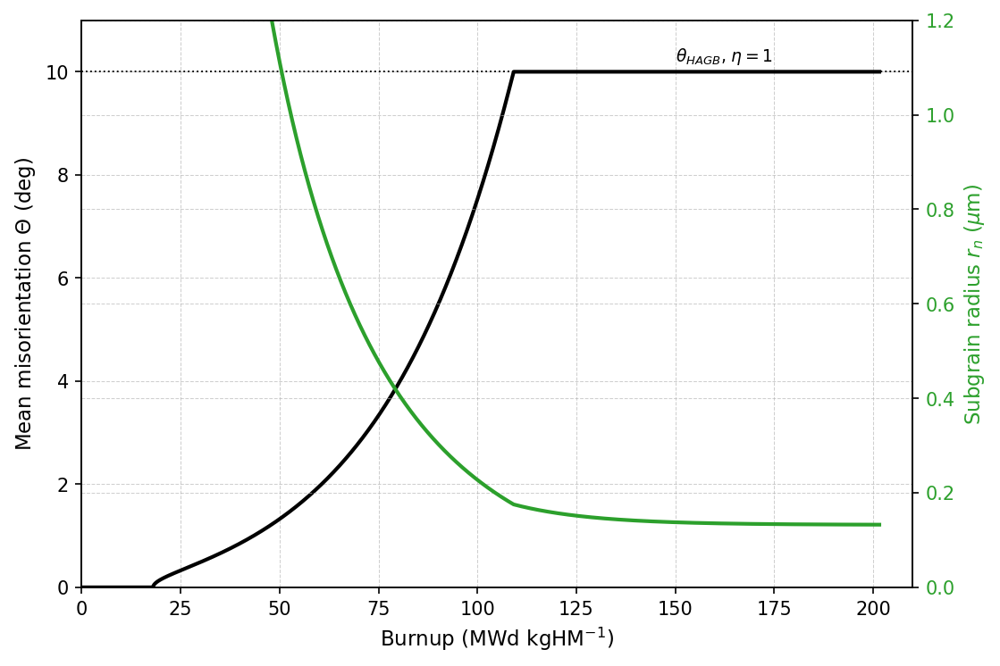

# HBS formation as a second-order phase transition (Landau functional)

Reference implementation of `iHighBurnupStructureFormation = 4`.

The High Burnup Structure is treated as a **second-order phase transition**. 

The order
parameter is the mean misorientation of the subgrains normalized to its maximum,
`eta = theta/theta_max`; the external condition is the local burnup. The free energy is a
Landau functional whose coefficients are built from four dislocation-energy contributions.
Minimizing it gives the equilibrium misorientation; the subgrain size follows from the same
wall geometry; the restructured fraction follows from the lever rule.

Model output:

| output | symbol | unit | equation | SCIANTIX variable |
|---|---|---|---|---|
| mean misorientation | `Theta` | deg | (9) | `Mean misorientation` |
| subgrain radius | `r_n` | m | (10) | `Subgrain radius` |
| restructured fraction | `X` | - | (11) | `Restructured volume fraction` |

The dislocation density is fixed to **Nogita & Une (1994)**.

## Files

| file | what it is |
|---|---|
| `hbs_formation_landau.py` | model |
| `data/ebsd_zacharie_onofri.csv` | the EBSD dataset |
| `calibrate.py` | the joint calibration of `beta`, `k` and `rho_c` |
| `compare_with_sciantix.py` | checks that the C++ reproduces this script |
| `compare_formation_options.py` | runs formation options 1-4 on one irradiation and compares them |
| `validation.py` | validation against both experimental datasets |
| `figures/` | figures, regenerated by the three scripts above |


---

## How to run

```bash
python3 hbs_formation_landau.py --selftest        # the model against itself, 27 invariants
python3 hbs_formation_landau.py --table           # reference behaviour vs burnup
python3 hbs_formation_landau.py --validate        # metrics against the EBSD dataset
python3 hbs_formation_landau.py --point 60 900    # the full state at one point
python3 hbs_formation_landau.py --plot            # needs matplotlib

# re-fit beta, k and rho_c -- run this after ANY change to Eq. (1) or Eq. (2):
python3 calibrate.py
python3 calibrate.py --front                      # what the size term costs on Theta
python3 calibrate.py --reference-table            # regenerate the frozen self-test table

# after building SCIANTIX and running the regression case:
python3 compare_with_sciantix.py ../../regression/hbs/test_UO2HBS_landau/output.txt

# option 4 next to the formation models already in SCIANTIX:
python3 compare_formation_options.py

# validation against the PIE and EBSD data, with figures:
python3 validation.py
```

---

## The equations


```
(1)  dislocation density -- Nogita & Une (1994)
     rho_tot(bu) = 10^(2.2e-2*bu + 13.8)                                 [m^-2]

(2)  shear modulus -- NEA, Recommendations on nuclear fuel properties,
     Nuclear Science NEA/NSC/R(2024)1 (2025), p. 124
     G(T,P,x,q) = 1e9 * [82.52*(1-q) + 94.91*q]
                      * (1 - P)^2 / (1 + 0.95275*P)
                      * (1 - 2.88078*x + 15.49419*x^2)
                      * (1.009549 - 1.182e-5*T - 6.671e-8*T^2)           [Pa]
     q = Pu fraction (0 for UO2), P = porosity, x = deviation from stoichiometry.
     G does NOT depend on burnup: the burnup enters through rho_tot alone.

(3)  wall geometry -- dislocations at spacing d give theta = b/d, so a wall
     carrying n families has line length L = n*theta/b, and the low-angle
     boundary area per unit volume is (S/V) = 3*sqrt(rho_LAGB)/beta
     rho_LAGB_max = (3*n*theta_max / (beta*b))^2                         [m^-2]
     SoverV_max   = 9*n*theta_max / (beta^2*b)                           [m^-1]
     dRoverR_max  = k*rho_LAGB_max / rho_tot                             [-]

(4)  dislocation line energies       E_D = G b^2 f(nu)/(4 pi) * ln(R/b)
     A1 = f(nu)/(4 pi)*ln(rho_c^(-1/2)/b)      random array, cut-off rho_c
     A2 = f(nu)/(4 pi)*ln(rho_tot^(-1/2)/b)    stress-screened inside the wall

(5)  the four energy contributions                                       [J/m^3]
     E1   = +rho_tot      * A1          * G b^2        order eta^0
            random dislocation array
     E2   = +rho_LAGB_max * (A2 - A1)   * G b^2        order eta^2
            dislocations reorganized into LAGB walls, stress-screened
     E3   = +SoverV_max   * gamma_max                  order eta^2
            energy of the new grain-boundary surface
     E4_1 = -rho_tot      * dRoverR_max * A1 * G b^2   order eta^2
            sweeping: annihilation by the mobile boundaries
     E4_2 = +rho_LAGB_max * dRoverR_max * A1 * G b^2   order eta^4
            sweeping: fourth-order term

(6)  Landau functional      F(bu, eta) = C0 + C2*eta^2 + C4*eta^4        [J/m^3]
     C0 = E1 ;   C2 = E2 + E3 + E4_1 ;   C4 = E4_2

(7)  equilibrium     dF/deta = 0  =>  eta_eq^2 = -C2/(2*C4), clipped at 0
     eta_eq = 0 wherever C2 >= 0, i.e. below the transition threshold

(8)  MEAN MISORIENTATION                                     <-- output 1
     Theta = min( eta_eq*theta_max*180/pi , theta_HAGB )                 [deg]
     eta   = (Theta*pi/180)/theta_max        re-derived after the cap

(9)  SUBGRAIN RADIUS                                         <-- output 2
     SoverV  = SoverV_max*eta ;   dRoverR = dRoverR_max*eta^2
     r_n     = min( 1.5/SoverV * (1 + dRoverR) , R_grain )               [m]
     capped at the host grain: a subgrain cannot be larger than its grain

(10) RESTRUCTURED FRACTION -- lever rule                     <-- output 3
     X = clip( (Theta - theta_u) / (theta_HAGB - theta_u), 0, ALPHA_MAX )

(11) driving force, for the nucleation criterion; reported, not an output
     dE_s = C0 + C2*eta^2 + C4*eta^4                                     [J/m^3]
```

Only even powers appear in Eq. (6) because the energy is invariant under the sign of theta.

**Why the lever rule is the right closure for Eq. (10).** The measured `Theta` is not a
local misorientation: it is the mean over the EBSD map, built as
`Theta = [AMis*(f1 - f10) + 10*f10]/100`, i.e. exactly the weighted mean of a two-phase
mixture — a fraction `f10` is restructured and sits at 10°, the rest is matrix and sits at
`AMis`. The functional, calibrated on `Theta`, therefore predicts the mixture **mean**, and
the fraction is recovered by inverting the mixture. `theta_u` is the misorientation of the
unrestructured matrix: the **measured** median of `AMis2Mean`. 
## Parameters

| symbol | value | unit | provenance |
|---|---|---|---|
| `b` | 3.889087296526011e-10 | m | Djonovic thesis |
| `nu` | 0.31 | - | — |
| `f(nu) = (1 - nu/2)/(1 - nu)` | 1.22464 | - | Hansen, Mater. Sci. Eng. 81 (1986) 141 |
| `gamma_max` | 1.100 × 1.545 = 1.6995 | J/m² | Zhang et al., MD on UO₂/CeO₂, [110] |
| `theta_max` | π − 2.723 = 0.418593 (23.984°) | rad | idem |
| `theta_HAGB` | 10 | deg | LAGB/HAGB boundary |
| `theta_u` | 2.20 | deg | median `AMis2Mean`, **measured** |
| G coefficients of Eq. (2) | 82.52, 94.91, 0.95275, 2.88078, 15.49419, 1.009549, 1.182e-5, 6.671e-8 | mixed | NEA/NSC/R(2024)1 p. 124 |
| `n` | 2 | - | Gourdet & Montheillet (2003), range 1–3 |
| `beta` | 28.104160337164743 | - | `calibrate.py`, joint fit |
| `k` | 0.050248987145961488 | - | idem |
| `rho_c` | 227863317789911.31 | m⁻² | idem; `rho_c^(-1/2)` = 0.066 µm |
| `P`, `x`, `q` | from SCIANTIX; 0.05, 0, 0 by default | -, -, - | inputs of Eq. (2) |
| `R_grain` | from SCIANTIX; 5 µm by default | m | ceiling of Eq. (9) |

`beta` is the analogue of the geometric parameter of Rest & Hofman (2000), who use 5; `k`
links the volume seen by a mobile grain boundary to the fraction of dislocations engaged in
the low-angle walls; `rho_c` is the outer cut-off of the dislocation strain field in
Eq. (4), i.e. the scale at which the field of a random array is screened.

---

## Calibration

`calibrate.py` is the fit. It prints its result
ready to paste into both `hbs_formation_landau.py` and the C++ parameter push.

```
J(k, beta, rho_c) = <(Theta_pred - Theta_obs)^2>/var(Theta)
                  + w <(r_pred - r_obs)^2>/var(r)
```

dimensionless and symmetric in the two observables, minimized by `differential_evolution` over `(k, beta, log10 rho_c)` from several seeds.

| w | beta | k | rho_c [m⁻²] | RMSE Θ [°] | RMSE r_n [µm] |
|---|---|---|---|---|---|
| 0 | 130.48 | 15.657 | 3.48e18 | 1.7220 | **4.5104** |
| 0.01 | 26.80 | 0.0420 | 2.32e14 | 1.7229 | 0.1131 |
| **0.05** | **28.10** | **0.0502** | **2.28e14** | **1.7395** | **0.0968** |
| 0.2 | 30.03 | 0.0733 | 2.08e14 | 1.8350 | 0.0677 |
| 1 | 30.86 | 0.1089 | 1.66e14 | 1.9762 | 0.0501 |

`w = 0.05` costs 1 % of RMSE(Θ) against `w = 0.01` and buys a radius the model can actually be held to.


---

## Reference behaviour, T = 600 K, P = 0.05

| bu [GWd/tU] | ρ_tot [m⁻²] | Θ [°] | r_n [µm] | X |
|---|---|---|---|---|
| 20 | 1.7378e14 | 0.0000 | — | 0.000000 |
| 40 | 4.7863e14 | 0.0000 | — | 0.000000 |
| 45.6089 | 6.3591e14 | 0.1303 | 5.0000 | 0.000000 |
| 46.0589 | 6.5057e14 | 0.4169 | 3.5222 | 0.000000 |
| 50 | 7.9433e14 | 1.3730 | 1.0799 | 0.000000 |
| 60 | 1.3183e15 | 3.1895 | 0.4762 | 0.126863 |
| 70 | 2.1878e15 | 5.3455 | 0.2909 | 0.403267 |
| 80 | 3.6308e15 | 8.1746 | 0.1946 | 0.765971 |
| 100 | 1.0000e16 | 10.0000 | 0.1534 | ≈1 |

Three burnups mark the changes of regime, at T = 600 K and P = 0.05:

| event | condition | bu [GWd/tU] |
|---|---|---|
| transition threshold | `C2 = 0`, Θ leaves zero | **45.5589** |
| restructuring starts | `Theta = theta_u` ⟹ X leaves zero | **54.5939** |
| fully restructured | `Theta = theta_HAGB` ⟹ X reaches its cap | **85.1879** |

Temperature enters only through `G(T)`, weakly but monotonically in the right direction —
heat suppresses restructuring:

| T [K] | 500 | 600 | 800 | 1000 | 1200 |
|---|---|---|---|---|---|
| Θ(60 GWd/tU) [°] | 3.218 | 3.190 | 3.115 | 3.014 | 2.879 |
| X(60 GWd/tU) | 0.1306 | 0.1269 | 0.1173 | 0.1043 | 0.0870 |

In the HBS range `r_n` is 0.15–0.48 µm, consistent with the measured ECD50%/2.

---

## Validation

`--validate` against `data/ebsd_zacharie_onofri.csv`:

```
mean misorientation  Theta   N = 41   RMSE = 1.7395 deg   R2 = 0.7772
restructured fraction X      N = 27   RMSE = 0.2003       R2 = 0.7411
subgrain radius       r_n    N = 14   RMSE = 0.0968 um    R2 = 0.5384
```

Point selection, identical to the calibration:

- **Θ** — every row with burnup > 0 (41 points).
- **X** — the rows that also carry a restructured fraction at 10° (27 points). Note that
  this closure has **no fitted parameter**; the ceiling set by the best monotone function of
  burnup alone is R² = 0.843, so the model covers 89 % of it.
- **r_n** — the rows that carry a size (14 points): ECD50 % of the *new grains* where it
  exists, of the *sub-grains* otherwise, **halved**, because ECD is a diameter and the model
  predicts a radius.

### Checking the C++ against this script

`compare_with_sciantix.py` replays the model on the `(burnup, temperature)` pairs a SCIANTIX
run actually stepped through, including the burnup conversion, the monotonic lock, and the
two conventions the C++ needs (radius `0.0` rather than `NaN`, fraction capped at
`ALPHA_MAX`). It compares the three output columns row by row. It does **not** use a tolerance. 

### Against the other formation models

`compare_formation_options.py` answers whether the model is *reasonable* next to what SCIANTIX already has. 

It runs
`iHighBurnupStructureFormation` = 1, 2, 3 and 4 on the same history, initial conditions and
time stepping, with the porosity model held at 3 so only the formation model varies. 

On the
`test_UO2HBS` irradiation (84000 h, 723 K, 2e19 fiss/m3s), burnup in MWd/kgU at which
`alpha_r` first reaches:

| threshold | 1 KJMA | 2 KJMA + bu_inc | 3 rho_d | **4 Landau** |
|---|---|---|---|---|
| 1 % | 19.5 | 34.5 | 51.2 | **49.4** |
| 10 % | 37.8 | 52.8 | 54.8 | **55.1** |
| 50 % | 64.2 | 79.3 | 72.3 | **72.8** |
| 90 % | 90.1 | 105.2 | 112.3 | **84.3** |
| 99 % | 109.7 | 124.6 | 161.7 | **86.5** |

[TBC]
Through the onset option 4 sits essentially on top of option 3, which is an independently
calibrated model — the useful cross-check. The two part company at the top end: the lever
rule of Eq. (10) **saturates**, because Θ reaches the 10° cap and X is then exactly 1,
whereas the KJMA forms approach 1 asymptotically. Under the previous calibration that
saturation produced a −7.9 % transient dip in the HBS porosity; with Eq. (2) and the refit
the dip is gone (+0.0 %), and option 2 is now the only one that shows one (−2.9 %). All four
options end within 0.17 % of the same porosity.


---

## Validation against experimental data

`validation.py`.

### PIE — Gerczak (2018) / Noirot (2015), 8 rim positions

The data formation option 3 was **fitted** on (`context/kjma_fit_comparison.py`). Option 4
has never seen it. Restructured fraction against local burnup, all 8 points assigned
T = 900 K:

| option | RMSE | R² | relation to this data |
|---|---|---|---|
| 1 KJMA, Barani (2020) | 0.1562 | +0.352 | constants from literature |
| 2 KJMA + bu_inc = 15 | 0.1095 | +0.682 | literature constants, selected here |
| 3 rho_d, Veshchunov (2009) | **0.0498** | **+0.934** | **fitted on these 8 points** |
| 4 Landau functional | 0.1851 | +0.090 | never seen them (out-of-sample) |

**Option 4 is the worst of the four here**, and that should be stated plainly rather than
explained away. Two things qualify it.

*The error is not spread out.* Per point:

| bu [MWd/kgU] | measured | opt 4 | opt 4 − measured |
|---|---|---|---|
| 64.32 | 0.2687 | 0.2227 | −0.0460 |
| 70.91 | 0.5438 | 0.4168 | −0.1270 |
| 72.27 | 0.5534 | 0.4613 | −0.0921 |
| 77.05 | 0.5979 | 0.6318 | +0.0339 |
| 83.86 | 0.6211 | 0.9193 | **+0.2982** |
| 88.41 | 0.6869 | 1.0000 | **+0.3131** |
| 90.68 | 0.7566 | 1.0000 | **+0.2434** |
| 129.77 | 1.0002 | 1.0000 | −0.0002 |

[TBC]
Three of the eight points carry a residual above +0.10, and all three sit at 84–91 MWd/kgU,
where the lever rule has already saturated — Θ reaches θ_HAGB at 85.5 MWd/kgU at this
temperature and porosity — while the data is still at 0.62–0.76. This is the same hard
saturation visible in `compare_formation_options.py`, and it is the model's most
questionable feature. `validation.py` derives this paragraph from the numbers rather than
asserting it, so it cannot go stale the next time `calibrate.py` moves the parameters.

*The comparison is confounded.* These 8 points carry **no resolved temperature**: 900 K is
assumed for all of them. The EBSD data shows that in exactly this burnup band the
temperature is a first-order variable — at 76–84 MWd/kgU the measured fraction runs from
0.20 at T ≈ 860 K to 1.00 at T ≈ 665 K. A model with a real temperature dependence is being
scored against points whose temperature is a guess. That cuts both ways and does not rescue
the saturation, but it does mean the aggregate R² on these 8 points is a weak instrument.

### EBSD — Zacharie-Aubrun et al. (2022) / Onofri et al. (2025)

41 radial points with a mean misorientation, 27 with a restructured fraction, 14 with a
subgrain size, each with its own TRANSURANUS local burnup, temperature and fission rate.
This is what option 4 is calibrated on, and the only dataset that constrains the two
quantities options 1–3 do not produce at all.

Restructured fraction, 27 points:

| option | RMSE | R² |
|---|---|---|
| 1 KJMA, Barani (2020) | 0.2773 | +0.504 |
| 2 KJMA + bu_inc = 15 | 0.2613 | +0.560 |
| 3 rho_d, Veshchunov (2009) | 0.2206 | +0.686 |
| 4 Landau functional | **0.2003** | **+0.741** |

and the two quantities only option 4 produces:

| observable | N | RMSE | R² |
|---|---|---|---|
| mean misorientation Θ | 41 | 1.7395 ° | +0.777 |
| subgrain radius r_n | 14 | 0.0968 µm | +0.538 |

So each model wins on its own data, which is the expected and uninteresting part. The
substantive result is that option 4 buys the misorientation and the subgrain size — which
options 1–3 do not produce at all — at the cost of a fraction that saturates too abruptly.


### In the HBS manuscript figures

`regression/hbs/plot.py --landau` adds option 4 to every figure of `regression/hbs/figures`.
On the five comparison figures — porosity, pore density, pore radius, Xe depletion and matrix
swelling, against Cappia, Spino, Noirot, Lassmann, Une and Walker — it is a third overlay
beside `test_UO2HBS` and `test_UO2HBS_0`. On the two moment diagnostics — pore variance `B`
and the coefficient of variation — it is a second curve beside `test_UO2HBS`; the Landau case
runs the full cluster-dynamics porosity, so it populates them. The stacked xenon mass balance
shows one case at a time, so in this mode it is drawn for the Landau case and titled as such.
One figure exists only in this mode:

| figure | content |
|---|---|
| `plot_hbs_state_landau.png` | mean misorientation Θ, Eq. (8), and subgrain radius r_n, Eq. (9) |

Nine figures in all, written with a `_landau` suffix, so the manuscript figures beside them
are untouched (the default output of that script is unchanged by the flag, verified pixel by
pixel).



The overlay is drawn from `regression/hbs/test_UO2HBS_landau`, which runs the **same history
and initial conditions** as `test_UO2HBS` so the curves are comparable. It differs from it in
the formation model (2 → 4) and, unavoidably, in the porosity model (2 → 3), since option 4
refuses porosity case 2 — so any difference between the two curves carries both changes, not
only the formation model. `compare_formation_options.py` is the clean single-variable
comparison.

What the overlay shows: HBS porosity rises later and far more steeply than the KJMA case,
reaching its plateau at the saturation corner near 84 MWd/kgHM.

---

---

## Pairing with the porosity model

`HighBurnupStructurePorosity.C` **case 2** reads the formation model's parameter vector
positionally, at offsets 0, 1 and 4, expecting the KJMA layout of formation options 1 and 2
(Avrami constant, transformation rate, incubation burnup). Option 4's vector is
`n, beta, k, rho_c, theta_u, ...`, so the pairing reads `n = 2` as the Avrami constant,
`beta = 28.10` as the transformation rate and `theta_u = 2.20` as the incubation burnup.

The failure is **silent**: the run completes and the HBS porosity comes out **zero**. So
option 4 refuses the pairing and aborts with a message naming the fix. Use
`iHighBurnupStructurePorosity = 3`, which is formation-agnostic — it uses only `alpha_r`,
its increment and the time step — or `0`.

---

## The dataset

`data/ebsd_zacharie_onofri.csv` is a lossless merge of `Zacharie_calculated.xlsx` (28 rows)
and `Onofri_calculated.xlsx` (14 rows) from the `Progetto-HBS` project: all 28 original
columns are kept, plus a leading `Dataset` column. CSV rather than XLSX so that the data is
diffable in git and loadable from the standard library.

- **Zacharie-Aubrun et al. (2022)**, *J. Appl. Phys.* **132**, 195903 — Std-0, Std-36,
  Std-61, Std-63, Std-73.
- **Onofri et al. (2025)**, *J. Nucl. Mater.* **615**, 155981 — Std-16, Std-37.

The misorientations, the restructured fractions and the ECD50 % are measured by EBSD. The
local conditions — burnup, effective burnup, temperature, fission-rate density, strain and
stress — come from TRANSURANUS runs of the same rods.

---

## References

- Nogita & Une, *Nucl. Instrum. Methods B* **91** (1994) 301–306.
- NEA, *Recommendations on nuclear fuel properties*, Nuclear Science NEA/NSC/R(2024)1 (2025),
  p. 124 — the shear modulus of Eq. (2).
- Hansen, *Mater. Sci. Eng.* **81** (1986) 141–161.
- Gourdet & Montheillet, *Acta Mater.* **51** (2003) 2685–2699.
- Rest & Hofman, *J. Nucl. Mater.* **277** (2000) 231–238.
- Zhang, Hansen, Harbison, Masengale, French & Aagesen, *A molecular dynamics survey of grain
  boundary energy in uranium dioxide and cerium dioxide*.
- Muramatsu, Takahashi et al. (2014) — nucleation criterion and phase field.
- Zacharie-Aubrun et al., *J. Appl. Phys.* **132** (2022) 195903.
- Onofri et al., *J. Nucl. Mater.* **615** (2025) 155981.

[TBC] Wheter there are quantites as grain boundary energy which are already defined in SCIANTIX (in that case take that value.)
dUE ESEMPI:
matrix_.setPoissonRatio((0.32051 * (1 - q) + 0.31882 * q) * (1.0 - 1.03223 * sciantix_variable["Porosity"].getFinalValue()) * (1.0 + 0.69962 * x - 7.52905 * pow(x, 2.0)) * (1.017906 - 6.420 * pow(10, - 5.0) * history_variable["Temperature"].getFinalValue() + 1.506 * pow(10, - 8.0) * pow(history_variable["Temperature"].getFinalValue(), 2.0))); // pag 124 Nuclear Science NEA/NSC/R(2024)1
	
GRAIN BOUNDARY ENERGY = SURFACE TENSION? = 0.7 N/m
Porosity should be in sciantix the total porosity? how it is related to the hbs one?