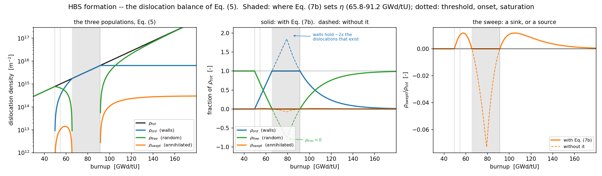
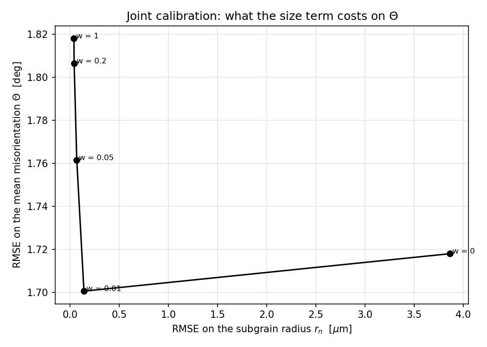
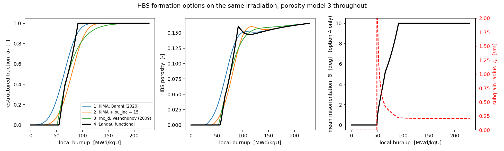
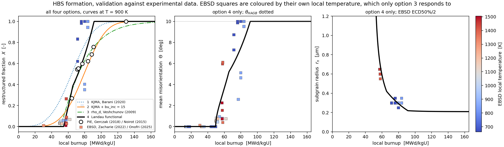
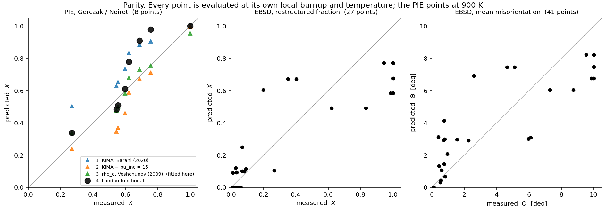

# HBS formation as a second-order phase transition (Landau functional)

Reference implementation of `iHighBurnupStructureFormation = 4`.

The High Burnup Structure is treated as a **second-order phase transition**. 

The order
parameter is the mean misorientation of the subgrains normalized to its maximum,
`eta = theta/theta_max` with `theta_max = theta_HAGB`, so `eta` runs over the full
`[0, 1]`; the external condition is the local burnup. The free energy is a
Landau functional built by splitting the dislocations into three populations that must add
up to `rho_tot` — free, stored in low-angle walls, annihilated by the sweeping boundaries —
and giving each the line energy of the state it is in. Minimizing it over the range of
`eta` for which that partition is physical gives the equilibrium misorientation; the
subgrain size follows from the same wall geometry; the restructured fraction follows from
the lever rule.

Model output:

| output | symbol | unit | equation | SCIANTIX variable |
|---|---|---|---|---|
| mean misorientation | `Theta` | deg | (9) | `Mean misorientation` |
| subgrain radius | `r_n` | m | (10) | `Subgrain radius` |
| restructured fraction | `X` | - | (11) | `Restructured volume fraction` |

The dislocation density is fixed to **Nogita & Une (1994)**.

## Files

| file | what it is |
|---|---|
| `hbs_formation_landau.py` | model |
| `data/ebsd_zacharie_onofri.csv` | the EBSD dataset |
| `calibrate.py` | the joint calibration of `beta`, `k` and `rho_c` |
| `compare_with_sciantix.py` | checks that the C++ reproduces this script |
| `compare_formation_options.py` | runs formation options 1-4 on one irradiation and compares them |
| `validation.py` | validation against both experimental datasets |
| `figures/` | figures, regenerated by the scripts above |
| `presentation/hbs_landau.tex` | Beamer deck on the model, the balance and the results (`latexmk -pdf`) |


---

## How to run

```bash
python3 hbs_formation_landau.py --selftest        # the model against itself, 32 invariants
python3 hbs_formation_landau.py --table           # reference behaviour vs burnup
python3 hbs_formation_landau.py --validate        # metrics against the EBSD dataset
python3 hbs_formation_landau.py --point 60 900    # the full state at one point
python3 hbs_formation_landau.py --plot            # needs matplotlib
python3 hbs_formation_landau.py --plot-populations figures/hbs_dislocation_populations.png

# re-fit beta, k and rho_c -- run this after ANY change to Eq. (1) or Eq. (2):
python3 calibrate.py
python3 calibrate.py --front                      # what the size term costs on Theta
python3 calibrate.py --reference-table            # regenerate the frozen self-test table

# after building SCIANTIX and running the regression case:
python3 compare_with_sciantix.py ../../regression/hbs/test_UO2HBS_landau/output.txt

# option 4 next to the formation models already in SCIANTIX:
python3 compare_formation_options.py

# validation against the PIE and EBSD data, with figures:
python3 validation.py
```

---

## The equations


```
(1)  dislocation density -- Nogita & Une (1994)
     rho_tot(bu) = 10^(2.2e-2*bu + 13.8)                                 [m^-2]

(2)  shear modulus -- NEA, Recommendations on nuclear fuel properties,
     Nuclear Science NEA/NSC/R(2024)1 (2025), p. 124
     G(T,P,x,q) = 1e9 * [82.52*(1-q) + 94.91*q]
                      * (1 - P)^2 / (1 + 0.95275*P)
                      * (1 - 2.88078*x + 15.49419*x^2)
                      * (1.009549 - 1.182e-5*T - 6.671e-8*T^2)           [Pa]
     q = Pu fraction (0 for UO2), P = porosity, x = deviation from stoichiometry.
     G does NOT depend on burnup: the burnup enters through rho_tot alone.

(3)  wall geometry -- dislocations at spacing d give theta = b/d, so a wall
     carrying n families has line length L = n*theta/b, and the low-angle
     boundary area per unit volume is (S/V) = 3*sqrt(rho_LAGB)/beta
     rho_LAGB_max = (3*n*theta_max / (beta*b))^2                         [m^-2]
     SoverV_max   = 9*n*theta_max / (beta^2*b)                           [m^-1]
     dRoverR_max  = k*rho_LAGB_max / rho_tot                             [-]

(4)  dislocation line energies       E_D = G b^2 f(nu)/(4 pi) * ln(R/b)
     A1 = f(nu)/(4 pi)*ln(rho_c^(-1/2)/b)      random array, cut-off rho_c
     A2 = f(nu)/(4 pi)*ln(rho_tot^(-1/2)/b)    stress-screened inside the wall

(5)  THE DISLOCATION BALANCE -- three populations closing on rho_tot     [m^-2]
     rho_ord(eta)   = rho_LAGB_max * eta^2         condensed into LAGB walls
     rho_swept(eta) = (rho_tot - rho_ord) * dRoverR(eta)     annihilated
     rho_free(eta)  = rho_tot - rho_ord - rho_swept          still random

     Only the FREE dislocations are swept: the ones already in a wall belong to
     the boundary, not to the volume the boundary passes through (Gourdet &
     Montheillet 2003).  That is what makes the sweep contribute at eta^4 as
     well as at eta^2, and the eta^4 term is what closes the functional.

     Each population carries the line energy of the state it is in -- the free
     ones the cut-off of a random array, the ones in the walls the cut-off
     screened by the wall itself, the swept ones nothing, they are gone:

         F = rho_free*A1*G b^2 + rho_ord*A2*G b^2                       [J/m^3]

     whose four contributions, at eta = 1, are
     E_free    = +rho_tot      * A1               * G b^2   order eta^0
     E_wall    = +rho_LAGB_max * (A2 - A1)        * G b^2   order eta^2
     E_sweep_2 = -rho_tot      * dRoverR_max * A1 * G b^2   order eta^2
     E_sweep_4 = +rho_LAGB_max * dRoverR_max * A1 * G b^2   order eta^4

(6)  Landau functional      F(bu, eta) = C0 + C2*eta^2 + C4*eta^4        [J/m^3]
     C0 = E_free ;   C2 = E_wall + E_sweep_2 ;   C4 = E_sweep_4

(7)  stationary point    dF/deta = 0  =>  eta^2 = -C2/(2*C4), clipped at 0
     eta = 0 wherever C2 >= 0, i.e. below the transition threshold

(7a) theta_max is a pure NORMALIZATION: rho_LAGB, S/V and dRoverR depend on
     theta = eta*theta_max alone, so it cancels out of Theta, r_n and X at fixed
     beta, k, rho_c.  Set to theta_HAGB, which makes eta = 1, Theta = theta_HAGB
     and rho_ord = rho_tot coincide at 91.32 GWd/tU.

(7b) ADMISSIBILITY -- the walls cannot hold more dislocations than exist, so
     rho_ord <= rho_tot.  The equilibrium is the minimum of F on the admissible
     interval, NOT the free stationary point:

         eta_balance = sqrt( min(rho_tot / rho_LAGB_max, 1) )             [-]
         eta_eq      = min( sqrt(-C2/(2*C4)), eta_balance )

     On the bound this is exactly the classical theta ~ sqrt(rho_tot),
         theta_bal = eta_balance*theta_max = beta*b*sqrt(rho_tot) / (3n)
     every dislocation is in a wall, the misorientation can only grow as fast as
     the dislocations that feed it, and the sweep stops because there is nothing
     free left to sweep.

(8)  MEAN MISORIENTATION                                     <-- output 1
     Theta = min( eta_eq*theta_max*180/pi , theta_HAGB )                 [deg]
     eta   = (Theta*pi/180)/theta_max        re-derived after the cap

(9)  SUBGRAIN RADIUS                                         <-- output 2
     SoverV  = SoverV_max*eta ;   dRoverR = dRoverR_max*eta^2
     r_n     = min( 1.5/SoverV * (1 + dRoverR) , R_grain )               [m]
     capped at the host grain: a subgrain cannot be larger than its grain

(10) RESTRUCTURED FRACTION -- lever rule                     <-- output 3
     X = clip( (Theta - theta_u) / (theta_HAGB - theta_u), 0, ALPHA_MAX )

(11) driving force, for the nucleation criterion; reported, not an output
     dE_s = C0 + C2*eta^2 + C4*eta^4                                     [J/m^3]
```

Only even powers appear in Eq. (6) because the energy is invariant under the sign of theta.

**Why the lever rule is the right closure for Eq. (10).** The measured `Theta` is not a
local misorientation: it is the mean over the EBSD map, built as
`Theta = [AMis*(f1 - f10) + 10*f10]/100`, i.e. exactly the weighted mean of a two-phase
mixture — a fraction `f10` is restructured and sits at 10°, the rest is matrix and sits at
`AMis`. The functional, calibrated on `Theta`, therefore predicts the mixture **mean**, and
the fraction is recovered by inverting the mixture. `theta_u` is the misorientation of the
unrestructured matrix: the **measured** median of `AMis2Mean`. 

### Why the balance of Eq. (7b) is not optional
`python3 hbs_formation_landau.py --plot-populations` draws the whole balance. Solid curves
are the model; dashed are the *same parameters* with Eq. (7b) switched off, which is what
the functional did before:



### Why there is no surface energy term

* **It is not the convention of the model this one follows.** In Gourdet & Montheillet
  (2003) and the CDRX models built on it, the stored energy is the dislocation energy
  alone, `tau·rho` with `tau = G b²/2`. Read-Shockley `gamma(theta)` does appear, but as
  the boundary energy that sets the driving pressure and the mobility of a *migrating*
  boundary — never as a term added to the stored energy.
* **It counts the walls twice.** Read-Shockley `gamma(theta)` *is* the strain energy of the
  dislocations in the wall, summed: `(S/V)·gamma = rho_LAGB × (line energy)`, which is the
  same object `E_wall` already carries through `A2`.

## Parameters

| symbol | value | unit | provenance |
|---|---|---|---|
| `b` | 3.889087296526011e-10 | m | Djonovic thesis |
| `f(nu) = (1 - nu/2)/(1 - nu)` | 1.213–1.225 over 500–1200 K | - | Hansen, Mater. Sci. Eng. 81 (1986) 141; ν from Eq. (2) |
| `theta_max` | = `theta_HAGB` = 0.174533 (10°) | rad | pure **normalization of the order parameter**: it cancels out of Θ, r_n and X, so it is set to `theta_HAGB` to make `eta = 1` ⟺ Θ = θ_HAGB ⟺ ρ_ord = ρ_tot |
| `theta_HAGB` | 10 | deg | LAGB/HAGB boundary |
| `theta_u` | 2.20 | deg | median `AMis2Mean`, **measured** |
| G coefficients of Eq. (2) | 82.52, 94.91, 0.95275, 2.88078, 15.49419, 1.009549, 1.182e-5, 6.671e-8 | mixed | NEA/NSC/R(2024)1 p. 124 |
| ν coefficients of Eq. (2) | 0.32051, 0.31882, 1.03223, 0.69962, 7.52905, 1.017906, 6.420e-5, 1.506e-8 | mixed | idem |
| `n` | 2 | - | Gourdet & Montheillet (2003), range 1–3; the same reference for the balance of Eq. (5) and for sweeping the free dislocations only |
| `beta` | 33.54724855333423 | - | `calibrate.py`, joint fit |
| `k` | 0.04696637283583627 | - | idem |
| `rho_c` | 1165846255229680.0 | m⁻² | idem; `rho_c^(-1/2)` = 0.029 µm |
| `P`, `x`, `q` | from SCIANTIX; 0.05, 0, 0 by default | -, -, - | inputs of Eq. (2) |
| `R_grain` | from SCIANTIX; 5 µm by default | m | ceiling of Eq. (9) |

`beta` is the analogue of the geometric parameter of Rest & Hofman (2000), who use 5; `k`
links the volume seen by a mobile grain boundary to the fraction of dislocations engaged in
the low-angle walls; `rho_c` is the outer cut-off of the dislocation strain field in
Eq. (4), i.e. the scale at which the field of a random array is screened.

---

## Calibration

`calibrate.py` is the fit. It prints its result
ready to paste into both `hbs_formation_landau.py` and the C++ parameter push.

```
J(k, beta, rho_c) = <(Theta_pred - Theta_obs)^2>/var(Theta)
                  + w <(r_pred - r_obs)^2>/var(r)
```

dimensionless and symmetric in the two observables, minimized by `differential_evolution` over `(k, beta, log10 rho_c)` from several seeds. The restructured fraction is deliberately **not** in the objective (`--fraction-weight 0` by default): it stays a prediction of the calibrated model, which is what makes its R² worth quoting.

| w | beta | k | rho_c [m⁻²] | RMSE Θ [°] | RMSE r_n [µm] |
|---|---|---|---|---|---|
| 0 | 99.93 | 1.7080 | 2.34e17 | 1.7180 | **3.3521** |
| 0.01 | 34.92 | 0.0650 | 1.34e15 | 1.7006 | 0.1410 |
| **0.05** | **33.55** | **0.0470** | **1.17e15** | **1.7616** | **0.0678** |
| 0.2 | 33.72 | 0.0172 | 1.12e15 | 1.8066 | 0.0410 |
| 1 | 33.96 | 0.0106 | 1.13e15 | 1.8181 | 0.0392 |

`w = 0.05` costs 4 % of RMSE(Θ) against `w = 0.01` and buys a radius the model can actually
be held to. Note how little `beta` now moves across the whole scan, 33.5–34.9 once the size
term has any weight at all: with Eq. (7b) in force `beta` is pinned by the balance rather
than free to shrink the subgrains at will, which is why `w = 0.05` already gets most of the
size accuracy that `w = 1` gets.



---

## Reference behaviour, T = 600 K, P = 0.05

| bu [GWd/tU] | ρ_tot [m⁻²] | Θ [°] | r_n [µm] | X | set by |
|---|---|---|---|---|---|
| 20 | 1.7378e14 | 0.0000 | — | 0.000000 | `C2 > 0` |
| 40 | 4.7863e14 | 0.0000 | — | 0.000000 | `C2 > 0` |
| 49.6112 | 7.7884e14 | 0.1943 | 5.0000 | 0.000000 | Eq. (7) |
| 50 | 7.9433e14 | 0.5810 | 3.6012 | 0.000000 | Eq. (7) |
| 54.5559 | 1.0005e15 | 2.2000 | 0.9638 | 0.000000 | Eq. (7) |
| 60 | 1.3183e15 | 3.6507 | 0.5899 | 0.185989 | Eq. (7) |
| 70 | 2.1878e15 | 5.8274 | 0.3755 | 0.465053 | **Eq. (7b)** |
| 80 | 3.6308e15 | 7.5072 | 0.2914 | 0.680406 | **Eq. (7b)** |
| 91.3204 | 6.4424e15 | 10.0000 | 0.2188 | ≈1 | **Eq. (7b)** |
| 100 | 1.0000e16 | 10.0000 | 0.2153 | ≈1 | `theta_HAGB` cap |
| 150 | 1.2589e17 | 10.0000 | 0.2095 | ≈1 | `theta_HAGB` cap |

The last column says which of the three branches of Eq. (7)–(7b) set `eta`. Between roughly
66 and 91 GWd/tU it is the dislocation balance, not the stationary point of the functional:
every dislocation is in a wall and `Theta` follows `beta·b·sqrt(rho_tot)/(3n)`.

Three burnups mark the changes of regime. They no longer depend on T, P or `x`:

| event | condition | bu [GWd/tU] |
|---|---|---|
| transition threshold | `C2 = 0`, Θ leaves zero | **49.5612** |
| restructuring starts | `Theta = theta_u` ⟹ X leaves zero | **54.5559** |
| fully restructured | `Theta = theta_HAGB` ⟹ X reaches its cap | **91.3204** |

The three of them are properties of the local burnup only. `G(T,P,x)` and `nu(T,P,x)` still
appear in `C2` and `C4`, but as the same factor `f(nu)·G·b²` in every term, so they cancel in
`eta² = -C2/(2 C4)`:

| T [K] | 500 | 600 | 800 | 1000 | 1200 |
|---|---|---|---|---|---|
| Θ(60 GWd/tU) [°] | 3.6507 | 3.6507 | 3.6507 | 3.6507 | 3.6507 |
| X(60 GWd/tU) | 0.18599 | 0.18599 | 0.18599 | 0.18599 | 0.18599 |

The same holds for the porosity and the stoichiometry deviation. `C0` and the driving force
of Eq. (11) do keep their `G(T)`, and `--selftest` checks both halves of this: the outputs
invariant, the driving force not.

In the HBS range `r_n` is 0.21–0.59 µm, consistent with the measured ECD50%/2.

---

## Validation

`--validate` against `data/ebsd_zacharie_onofri.csv`:

```
mean misorientation  Theta   N = 41   RMSE = 1.7616 deg   R2 = 0.7715
restructured fraction X      N = 27   RMSE = 0.2053       R2 = 0.7283
subgrain radius       r_n    N = 14   RMSE = 0.0678 um    R2 = 0.7737
```

Point selection, identical to the calibration:

- **Θ** — every row with burnup > 0 (41 points).
- **X** — the rows that also carry a restructured fraction at 10° (27 points). Note that
  this closure has **no fitted parameter**; the ceiling set by the best monotone function of
  burnup alone is R² = 0.843, so the model covers 86 % of it. That ceiling is now the right
  one to quote against: since the surface term went, the model *is* a function of burnup
  alone, so it can no longer in principle do better than it.
- **r_n** — the rows that carry a size (14 points): ECD50 % of the *new grains* where it
  exists, of the *sub-grains* otherwise, **halved**, because ECD is a diameter and the model
  predicts a radius.

### Checking the C++ against this script

`compare_with_sciantix.py` replays the model on the `(burnup, temperature)` pairs a SCIANTIX
run actually stepped through, including the burnup conversion, the monotonic lock, and the
two conventions the C++ needs (radius `0.0` rather than `NaN`, fraction capped at
`ALPHA_MAX`). It compares the three output columns row by row. It does **not** use a tolerance. 

### Against the other formation models

`compare_formation_options.py` answers whether the model is *reasonable* next to what SCIANTIX already has. 

It runs
`iHighBurnupStructureFormation` = 1, 2, 3 and 4 on the same history, initial conditions and
time stepping, with the porosity model held at 3 so only the formation model varies. 

On the
`test_UO2HBS` irradiation (84000 h, 723 K, 2e19 fiss/m3s), burnup in MWd/kgU at which
`alpha_r` first reaches:

| threshold | 1 KJMA | 2 KJMA + bu_inc | 3 rho_d | **4 Landau** |
|---|---|---|---|---|
| 1 % | 19.5 | 34.5 | 51.2 | **54.9** |
| 10 % | 37.8 | 52.8 | 54.8 | **57.5** |
| 50 % | 64.2 | 79.3 | 72.3 | **71.8** |
| 90 % | 90.1 | 105.2 | 112.3 | **88.2** |
| 99 % | 109.7 | 124.6 | 161.7 | **91.1** |

Through the onset option 4 sits close to option 3, which is an independently calibrated
model — the useful cross-check: they agree to 0.5 MWd/kgU at the 50 % crossing. The two
part company at the top end: the lever rule of Eq. (10) **saturates**, because Θ reaches
the 10° cap and X is then exactly 1, whereas the KJMA forms approach 1 asymptotically.
Eq. (7b) pushed that saturation from 84.0 to 91.1 MWd/kgU, but it did not remove it.

Downstream that shows up as a **transient dip in the HBS porosity** right after the corner:

| | 1 KJMA | 2 KJMA + bu_inc | 3 rho_d | **4 Landau** |
|---|---|---|---|---|
| overshoot | 0.151897 at 106.8 | 0.160076 at 117.0 | none | **0.160845 at 91.4** |
| dip after it | −0.6 %, to 0.151002 at 122.5 | −3.0 %, to 0.155196 at 144.1 | +0.0 % | **−8.4 %**, to 0.147322 at 113.5 |
| final | 0.165361 | 0.165306 | 0.165592 | 0.165376 |

All four end within 0.17 % of the same porosity, so the dip is a transient, not a different
end state. It is the porosity model's response to `dalpha_r/dt` falling to zero abruptly:
porosity case 3 drives pore nucleation from that derivative, so a hard corner in `alpha_r`
starves nucleation while the existing pores keep coarsening. Option 4 has the hardest corner
of the four and therefore the deepest dip; option 3, whose `alpha_r` never actually
saturates, has none at all.

**Eq. (7b) did not fix this, and made it slightly worse** (−6.3 % → −8.4 %). The bound
softened the *approach* to saturation but the lever rule still terminates at a finite
burnup, so `dalpha_r/dt` still falls off a cliff — and it now does so at a higher porosity,
which is why the dip is deeper. Removing the corner needs a different closure for Eq. (10),
not a different bound on Eq. (7); it is the outstanding modelling issue, together with the
missing temperature dependence.



---

## Validation against experimental data

`validation.py`.

### PIE — Gerczak (2018) / Noirot (2015), 8 rim positions

The data formation option 3 was **fitted** on (`context/kjma_fit_comparison.py`). Option 4
has never seen it. Restructured fraction against local burnup, all 8 points assigned
T = 900 K:

| option | RMSE | R² | relation to this data |
|---|---|---|---|
| 1 KJMA, Barani (2020) | 0.1562 | +0.352 | constants from literature |
| 2 KJMA + bu_inc = 15 | 0.1095 | +0.682 | literature constants, selected here |
| 3 rho_d, Veshchunov (2009) | **0.0498** | **+0.934** | **fitted on these 8 points** |
| 4 Landau functional | 0.1298 | +0.553 | never seen them (out-of-sample) |

Option 4 comes **third of the four**, behind option 3 — which was fitted on exactly these
points — and behind option 2. That is where the dislocation balance of Eq. (7b) shows its
worth: before it, option 4 scored RMSE 0.1848 with R² **+0.094**, the worst of the four.
The bound did not change what the model is fitted on; it changed where it saturates, and
these 8 points sit in that band.

*Where the residual error is.* Per point:

| bu [MWd/kgU] | measured | opt 4 | opt 4 − measured |
|---|---|---|---|
| 64.32 | 0.2687 | 0.3388 | +0.0701 |
| 70.91 | 0.5438 | 0.4825 | −0.0613 |
| 72.27 | 0.5534 | 0.5093 | −0.0441 |
| 77.05 | 0.5979 | 0.6111 | +0.0132 |
| 83.86 | 0.6211 | 0.7793 | **+0.1582** |
| 88.41 | 0.6869 | 0.9089 | **+0.2220** |
| 90.68 | 0.7566 | 0.9794 | **+0.2228** |
| 129.77 | 1.0002 | 1.0000 | −0.0002 |

Three of the eight still carry a residual above +0.10, at 84–91 MWd/kgU, where the lever
rule saturates while the data is
still at 0.62–0.76.

### EBSD — Zacharie-Aubrun et al. (2022) / Onofri et al. (2025)

41 radial points with a mean misorientation, 27 with a restructured fraction, 14 with a
subgrain size, each with its own TRANSURANUS local burnup, temperature and fission rate.
This is what option 4 is calibrated on, and the only dataset that constrains the two
quantities options 1–3 do not produce at all.

Restructured fraction, 27 points:

| option | RMSE | R² |
|---|---|---|
| 1 KJMA, Barani (2020) — at bu_eff | 0.2476 | +0.605 |
| 2 KJMA + bu_inc = 15 — at bu_eff | 0.2618 | +0.558 |
| 3 rho_d, Veshchunov (2009) — at bu_local | 0.2206 | +0.686 |
| 4 Landau functional — at bu_local | **0.2053** | **+0.728** |

and the two quantities only option 4 produces:

| observable | N | RMSE | R² |
|---|---|---|---|
| mean misorientation Θ | 41 | 1.7616 ° | +0.772 |
| subgrain radius r_n | 14 | 0.0678 µm | +0.774 |

So each model wins on its own data, which is the expected and uninteresting part. The
substantive result is that option 4 buys the misorientation and the subgrain size — which
options 1–3 do not produce at all.




---

## Pairing with the porosity model

`HighBurnupStructurePorosity.C` **case 2** reads the formation model's parameter vector
positionally, at offsets 0, 1 and 4, expecting the KJMA layout of formation options 1 and 2
(Avrami constant, transformation rate, incubation burnup). Option 4's vector is
`n, beta, k, rho_c, theta_u, ...`, so the pairing reads `n = 2` as the Avrami constant,
`beta = 33.55` as the transformation rate and `theta_u = 2.20` as the incubation burnup.

The failure would be **silent**: the run completes and the HBS porosity comes out **zero**.
Use `iHighBurnupStructurePorosity = 3`, which is formation-agnostic — it uses only
`alpha_r`, its increment and the time step — or `0`.

Option 4 now **refuses** the pairing: `HighBurnupStructurePorosity.C` `case 2` calls
`ErrorMessages::Fatal` when `iHighBurnupStructureFormation = 4`, with a message naming the
fix, rather than running to completion with zero porosity.

---

## The dataset

`data/ebsd_zacharie_onofri.csv` is a lossless merge of `Zacharie_calculated.xlsx` (28 rows)
and `Onofri_calculated.xlsx` (14 rows) from the `Progetto-HBS` project: all 28 original
columns are kept, plus a leading `Dataset` column. CSV rather than XLSX so that the data is
diffable in git and loadable from the standard library.

- **Zacharie-Aubrun et al. (2022)**, *J. Appl. Phys.* **132**, 195903 — Std-0, Std-36,
  Std-61, Std-63, Std-73.
- **Onofri et al. (2025)**, *J. Nucl. Mater.* **615**, 155981 — Std-16, Std-37.

The misorientations, the restructured fractions and the ECD50 % are measured by EBSD. The
local conditions — burnup, effective burnup, temperature, fission-rate density, strain and
stress — come from TRANSURANUS runs of the same rods.

---

## Which burnup, and which quantities come from SCIANTIX

| option | variable read | where |
|---|---|---|
| 1, 2 — KJMA | `sciantix_variable["Effective burnup"]` | `HighBurnupStructureFormation.C`, `option == 1 \|\| option == 2` |
| 3 — ρ_d Veshchunov | `sciantix_variable["Burnup"]` | same file, `option == 3` |
| 4 — Landau | `sciantix_variable["Burnup"]` | same file, `option == 4` |

`EffectiveBurnup.C` integrates the specific power but **stops accumulating above 1273.15 K** (Khvostov, Holt-style).

### Poisson ratio: taken from NEA, like the shear modulus

The same NEA page carries a correlation for ν in the shape of Eq. (2), and it is now used:
there is no reason to correlate one elastic constant and hold the other at a single value.
It enters through `f(nu) = (1 - nu/2)/(1 - nu)`, a prefactor common to `A1` and `A2` in
Eq. (4):

| T [K] | P | ν(NEA) | f(ν) | f(0.31), the old constant | ratio |
|---|---|---|---|---|---|
| 600 | 0.05 | 0.29935 | 1.21362 | 1.22464 | 0.991 |
| 723 | 0.0118 | 0.31007 | 1.22471 | 1.22464 | **1.000** |
| 900 | 0.05 | 0.29556 | 1.20978 | 1.22464 | 0.988 |
| 1200 | 0.05 | 0.29259 | 1.20680 | 1.22464 | 0.985 |

### Porosity

- `sciantix_variable["Porosity"]` starts at `1 - rho_fuel/10960` from the initial conditions
  and is then moved only by `Densification.C`. It is the **as-fabricated/densification**
  porosity of the unrestructured matrix.
- `sciantix_variable["HBS porosity"]` is a distinct variable, written by
  `HighBurnupStructurePorosity.C`. **Nothing adds it into `Porosity`.**
- `SetMatrix.C` uses each with its own matrix: `Porosity` for the Young's modulus of the
  `UO2` matrix, `HBS porosity` for that of the `UO2HBS` matrix.

Eq. (2) uses `Porosity`: the Landau functional describes the
**unrestructured matrix** transforming, and the HBS porosity is a property of the product phase. 

---

## The C++ implementation

`iHighBurnupStructureFormation = 4` is implemented in
`src/models/HighBurnupStructureFormation.C`, `case 4`. The resolution block mirrors
`hbs_state()` statement by statement, in the same order, so the two can be read side by
side. `compare_with_sciantix.py` is what keeps them one — on
`regression/hbs/test_UO2HBS_landau` it reports **every value inside its bracket on all
5001 timesteps**, for all four columns, with zero residual.

What the port adds:

| where | what |
|---|---|
| `HighBurnupStructureFormation.C` | `case 4`: parameter vector `n, beta, k, rho_c, theta_max, theta_HAGB, theta_u, b` (offsets 0–7) and the resolution block |
| `SetVariablesFunctions.C` | `"Mean misorientation"` (deg, slot 202) and `"Subgrain radius"` (m, slot 203), gated on `toOutputHighBurnupStructure` |
| `UpdateVariables.C` | slots 202 and 203 in the restart map |
| `HighBurnupStructurePorosity.C` | `case 2` now aborts with `ErrorMessages::Fatal` when paired with formation option 4, instead of silently reading `n = 2` as the Avrami constant and producing zero porosity |

Two conventions differ from the reference script, deliberately, and
`compare_with_sciantix.py` replays both: the subgrain radius is `0.0` rather than `NaN`
below the threshold, where it is not a length; and the restructured fraction is capped at
`ALPHA_MAX = 1 - 1e-9`, because SCIANTIX divides by `1 - alpha` downstream. The C++ also
carries the monotonic lock of option 3. On this history it never binds (0 of 5001 steps) —
with the burnup non-decreasing and the outputs functions of burnup alone it cannot — so it
is a guard against a history that steps the burnup backwards, not part of the physics.

Inputs read from SCIANTIX: `"Burnup"` (local, not effective — same reason as option 3),
`"Temperature"`, `"Porosity"`, `"Stoichiometry deviation"` and `"Grain radius"`. The last
two are read one step late, since `StoichiometryDeviation()` and `GrainGrowth()` both run
after `HighBurnupStructureFormation()` in `Simulation::execute()`. That is immaterial for
the first: the deviation from stoichiometry cancels out of all three outputs. For the grain
radius it means the ceiling of Eq. (9) is the radius at the start of the step.

Still not implemented: the `--landau` mode of `regression/hbs/plot.py` (see
*In the HBS manuscript figures* above).

---

## References

- Nogita & Une, *Nucl. Instrum. Methods B* **91** (1994) 301–306.
- NEA, *Recommendations on nuclear fuel properties*, Nuclear Science NEA/NSC/R(2024)1 (2025),
  p. 124 — the shear modulus of Eq. (2).
- Hansen, *Mater. Sci. Eng.* **81** (1986) 141–161.
- Gourdet & Montheillet, *Acta Mater.* **51** (2003) 2685–2699.
- Rest & Hofman, *J. Nucl. Mater.* **277** (2000) 231–238.
- Muramatsu, Takahashi et al. (2014) — nucleation criterion and phase field.
- Zacharie-Aubrun et al., *J. Appl. Phys.* **132** (2022) 195903.
- Onofri et al., *J. Nucl. Mater.* **615** (2025) 155981.
