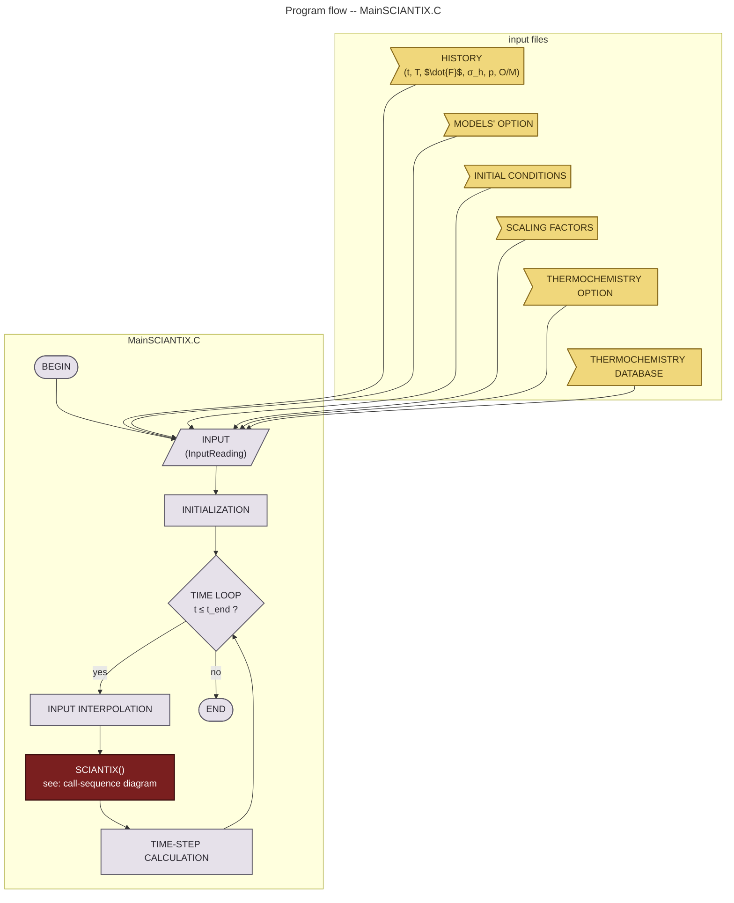
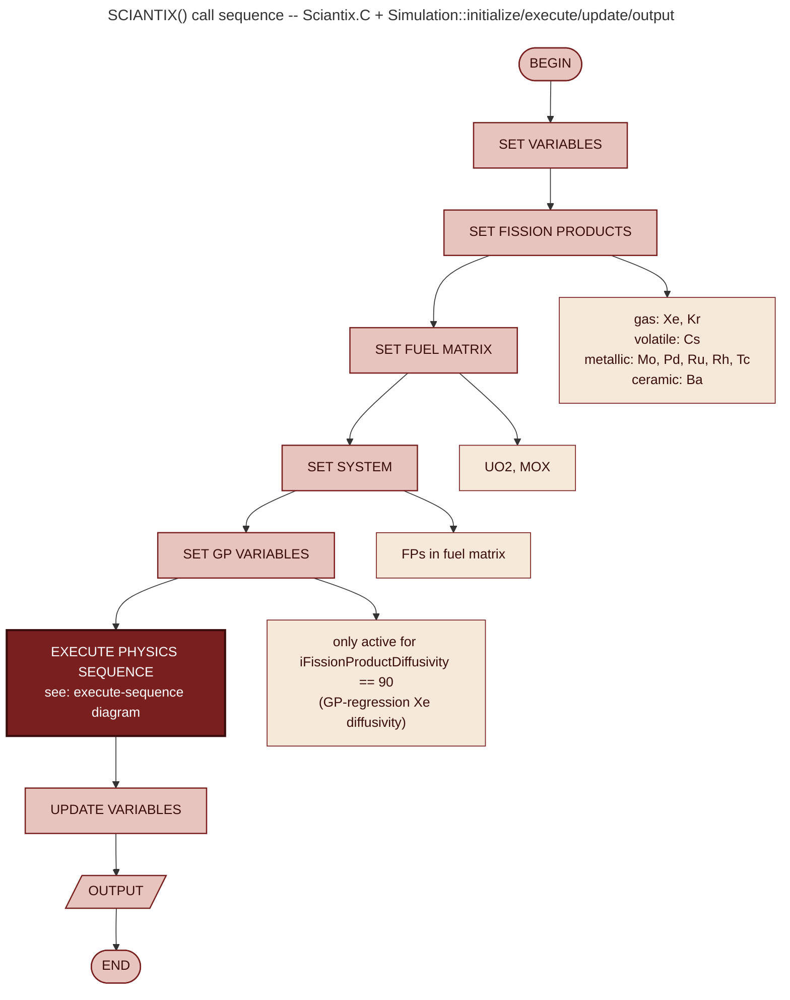
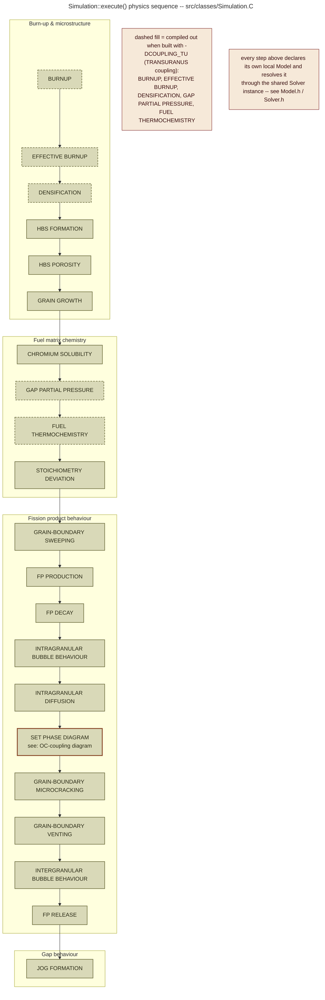
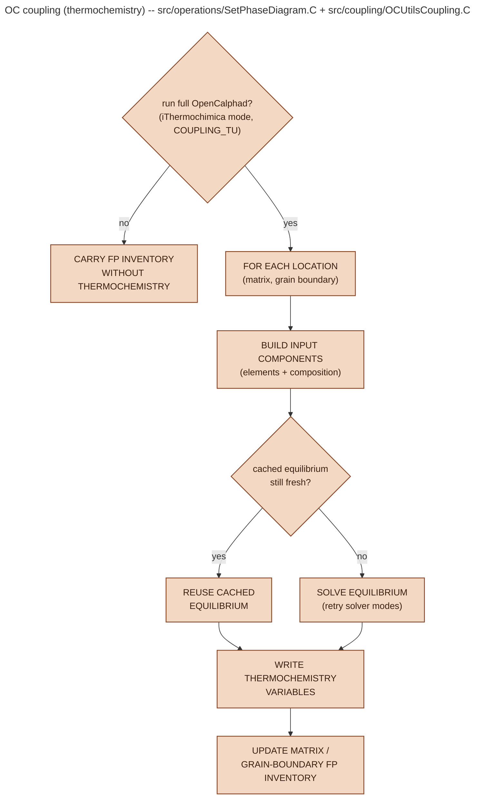

# SCIANTIX execution workflow

This is a set of four hand-maintained diagrams, each mapping onto one
source-level scope, from the outermost driver loop down to the OpenCalphad
(OC) coupling. Each diagram ends where the next one begins, so read them in
order:

1. **Program flow** -- the `MainSCIANTIX.C` driver loop and its input files.
2. **`SCIANTIX()` call sequence** -- `Sciantix.C` and the five `Simulation::set*`
   calls made by `Simulation::initialize()`, followed by `execute()`,
   `update()`, `output()`.
3. **`Simulation::execute()` physics sequence** -- the ordered list of physics
   calls in `src/classes/Simulation.C`, grouped the way the file's own
   comments group them (burn-up/microstructure, fuel chemistry, fission
   product behaviour, gap behaviour).
4. **OC coupling** -- what `Simulation::SetPhaseDiagram()`
   (`src/operations/SetPhaseDiagram.C`) actually does when it hands off to
   OpenCalphad via `src/coupling/OCUtilsCoupling.C`.

Diagram 4 is deliberately still an abstraction, not a line-by-line translation
of `SetPhaseDiagram.C`: the real function also handles per-location
equilibrium-staleness caching (temperature/pressure/composition tolerances)
and retries several OpenCalphad solver modes before giving up. Read
`SetPhaseDiagram.C` and `OCUtilsCoupling.C` directly if you need that level of
detail -- the diagram only shows the decision points that change the control
flow (skip vs. solve, cache-hit vs. cache-miss).

Two things worth calling out that are easy to miss from the code alone:

- **`-DCOUPLING_TU` removes physics, not just changes behaviour.** When
  SCIANTIX is compiled for TRANSURANUS coupling, `Simulation::execute()`
  compiles out `Burnup()`, `EffectiveBurnup()`, `Densification()`,
  `GapPartialPressure()`, and `UO2Thermochemistry()` entirely (`#if
  !defined(COUPLING_TU)` in `Simulation.C`) -- burnup and gap pressure/oxygen
  potential are supplied by the host code instead. Diagram 3 marks these with
  a dashed fill.
- **There is no separate "solver declaration" phase.** Every physics call in
  `execute()` declares its own local `Model`, resolves it through the
  `Simulation`-owned `Solver` instance, and discards it -- e.g.
  `Simulation::Burnup()` and `Simulation::GrainGrowth()` each build their own
  `Model model_;` and call `solver.Integrator(...)` /
  `solver.QuarticEquation(...)` inline. This repeats independently in each of
  the ~20 calls in diagram 3; it is not a pipeline stage you can point to.

## 1. Program flow -- `MainSCIANTIX.C`




## 2. `SCIANTIX()` call sequence -- `Sciantix.C` + `Simulation::initialize/execute/update/output`




## 3. `Simulation::execute()` physics sequence -- `src/classes/Simulation.C`




## 4. OC coupling -- `src/operations/SetPhaseDiagram.C` + `src/coupling/OCUtilsCoupling.C`




## Maintaining these diagrams

These files are plain, hand-maintained Mermaid diagrams -- there is no script
that regenerates them from the C++ source, so when `Sciantix.C`,
`Simulation.C`, or `SetPhaseDiagram.C` change in a way that affects control
flow, edit the corresponding `.mmd` file (and the matching fenced block
above) directly.

Each `.mmd` file renders standalone. To regenerate a PNG after editing one:

```bash
npx -p @mermaid-js/mermaid-cli mmdc \
  -i program_flow.mmd -o images/program_flow.png \
  -p puppeteer-config.json -b white -w 1800
```

(swap in `call_sequence`, `execute_sequence`, or `oc_coupling` as needed).
